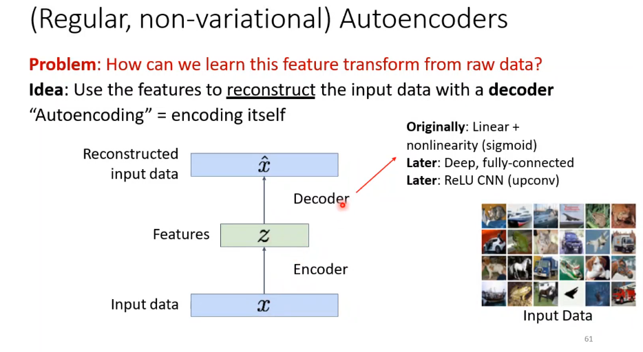
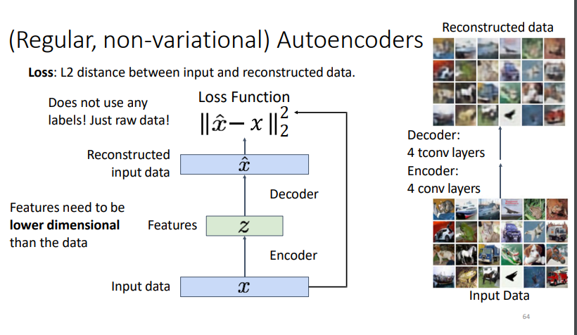
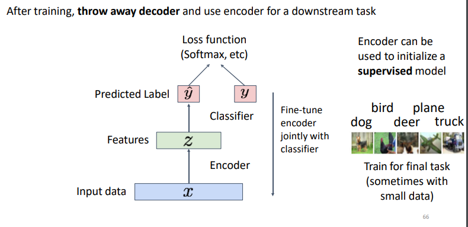
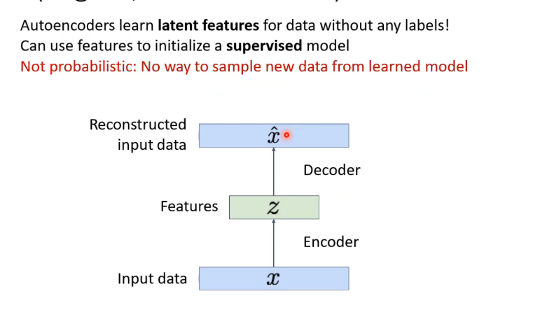

encoder is down sampling and decoder is up sampling
Features should extract useful information (maybe object identities, properties, scene type, etc) that we can use for downstream tasks But we can't observe features!

[[Z type]]

used in **Compression**, Classifier as the **Z** is just like CNN

If there is no bottleneck and no regularization -> no learning, the input can be simply copied to the output.