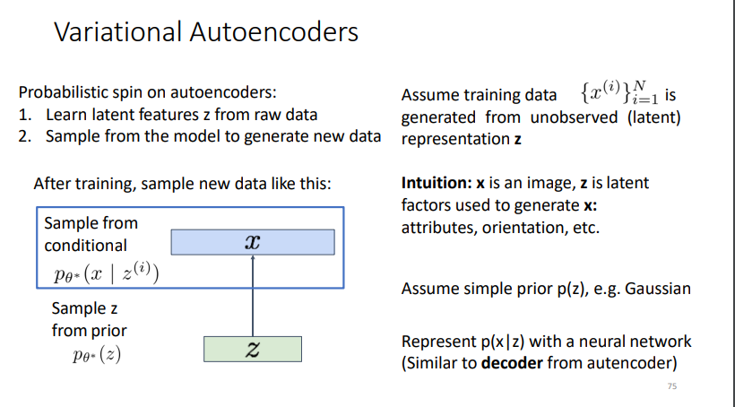
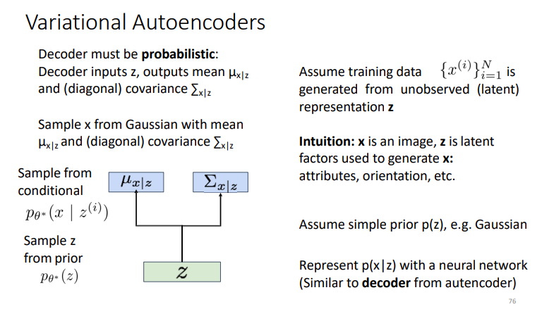
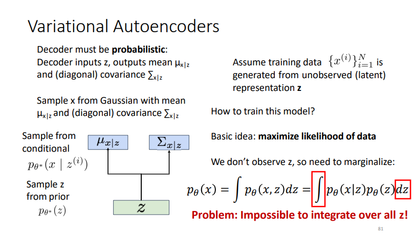
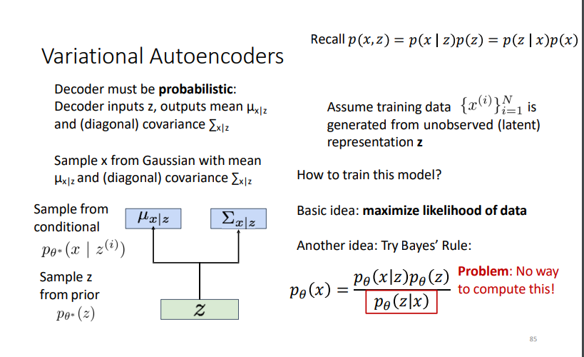
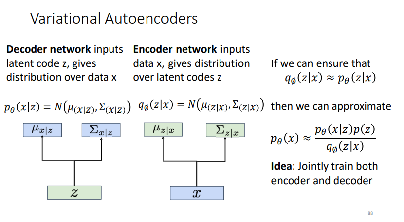
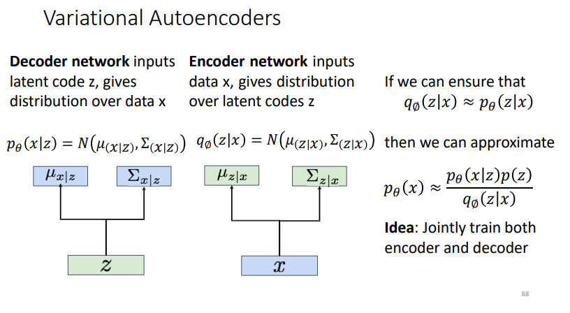
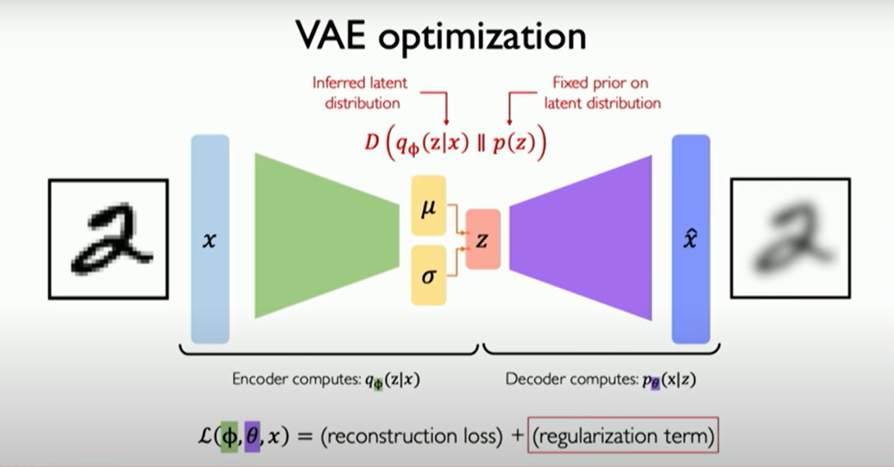
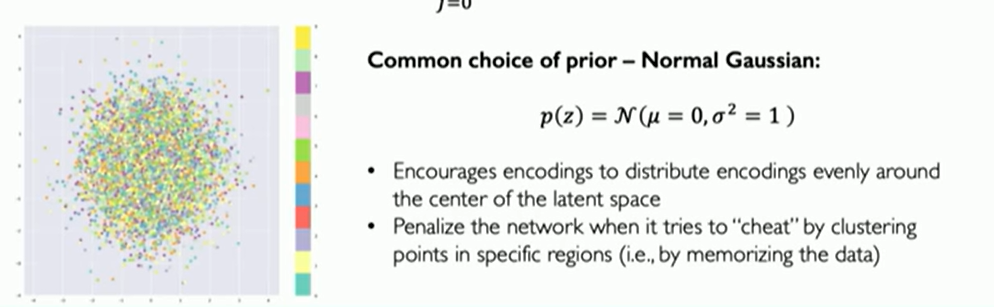
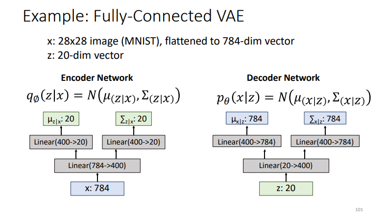

intro : [[Autoencoder Regular]]

> Z is not vector of scaler values 
	now its a probability p(x | z)

If we could observe the z for each x, then could train a conditional generative model p(x | z)

p(x | z), can compute this with decoder network
p(z), we assumed Gaussian prior for z

Problem: Impossible to integrate over all z!
-> Solution: try bayes rule p(x , z) = p(x | z) p(z) = p(z | x) p(x)

-> Solution: Train another network (encoder) that learns **q**(z | x) ~= **p**(z | x) 

VAE provide solutions to these two difficulties of latent variable models:

1. How to define the latent variables z
2. How to deal with integral over z

the loss function is just the reconstruction loos ($||\hat{x} - x||^2$) 
regularization is for measuring how much the inferred data distribution differ from our prior hypothesis (guess about how the data latent variable space may look like) (little gaussian circles from [[latent variable models]])  $D_{kl} (q_{\phi} || P(z))$ to constrain them (the encoder) to stay or follow that prior distribution p(z)

Encoder = compress data into loy.ver-dimensional representation (latent space)

[[intuition and regularization and prior in the latent space]]

#### training 
[[VAE training]]

### example 

it must have ReLu (any activation) in between
Covariance matrix should be 20x20, but we approximated it to take the diagonal only **assumption** 

[[VAE Understand the Z features]]
[[VAE code]]

[[GANs]]
[[GAN code]]

