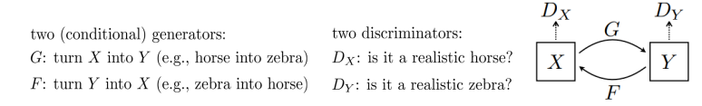

### DC-GAN

	generate the latent Z on stages not in one step

understanding the Z

### WGAN
### WGAN‐GP

### Progressive Growing of GANs
generate high resolution images step by step

### StyleGAN2

### style + image

### semi-supervised
### Conditional GANs

	normalization for each separate class

### spectral normalization 
 
### BigGAN
### videos
### Text to Image
### Image Super‐Resolution: Low‐Res to High‐Res
### Image‐to‐Image Translation: Pix2Pix
take a draft image, segmentation, or drawing and generate a real image
### Unpaired Image‐to‐Image Translation: CycleGAN

