Generative Adversarial Networks

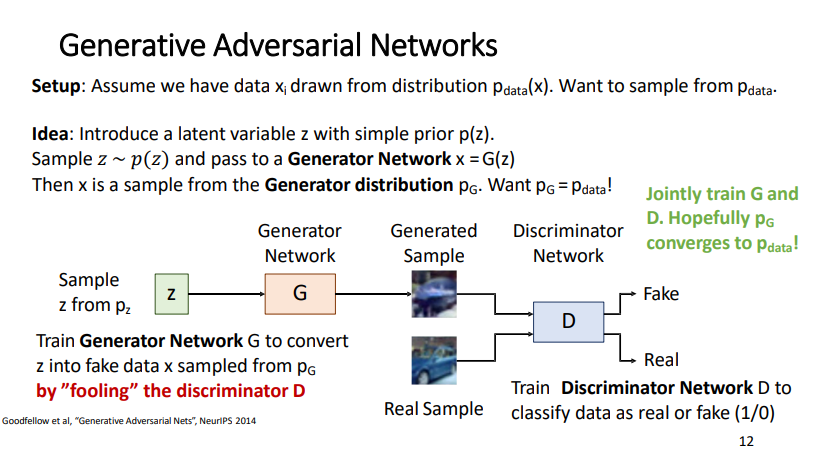

as we don't know the two distributions, thus we can't know if the training is done or not
so we want to compare the two distributions [[Distribution comparison formulas]] 

at best case of training the fake = real = 50% i.e. good discriminator doesn't which to decide

[[intuition of GAN tranining]]

### training
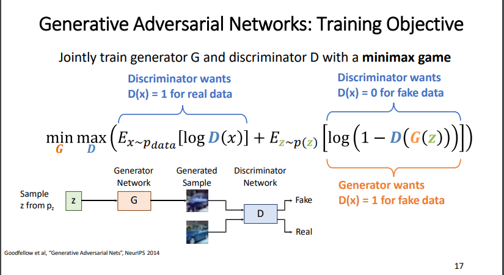

1st term if we sampled an image from the data the D want to classify = 1 (real)
2nd term in if we sampled an image from the Z latent space the DG(z) term:
* the D want it to be = 0 (fake)
	* thus, D want to maximize this side (1-DG(z))
* the G want it to be = 1 (real)
	* thus, G want to minimize this side (1-DG(z))

### gradient
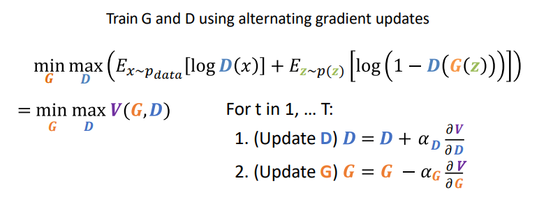
We are not minimizing any overall loss! No training curves to look at! 😢

the second case of #vanishinggradient but in the beginning of the training 
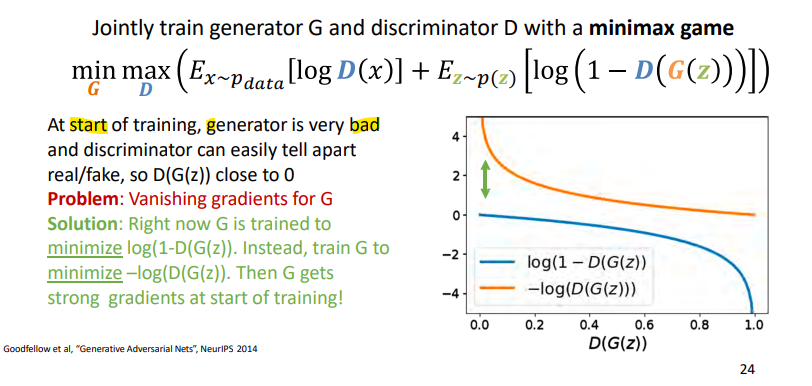

Optimal training case
	This minimax game achieves its global minimum when pG = pdata!

optimality proof
[[optimality proof]]
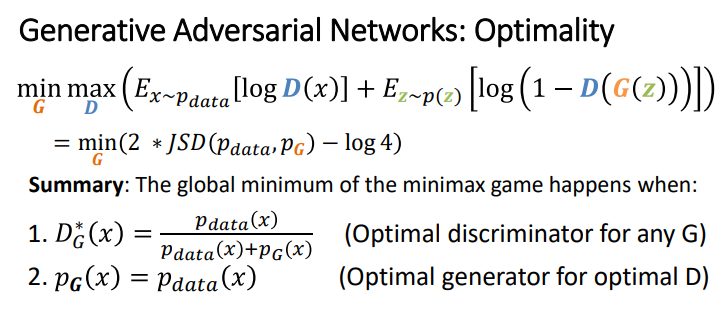

### training problems of GANs
vanishing gradients is solved
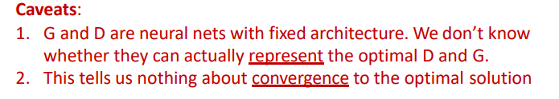
3) training oscillation in the min max property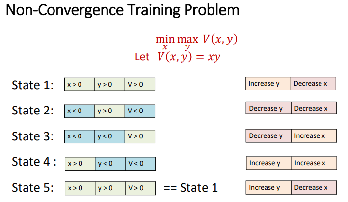
state 1: x, y are + then v is +
max(y) will maximize y and min(x) will minimize x
state 2: x is - and y is + thus v is -
max(y) to maximize y it will make it - to make v +
… till return to the first state

4) same generated class from G to get maximum reward from D 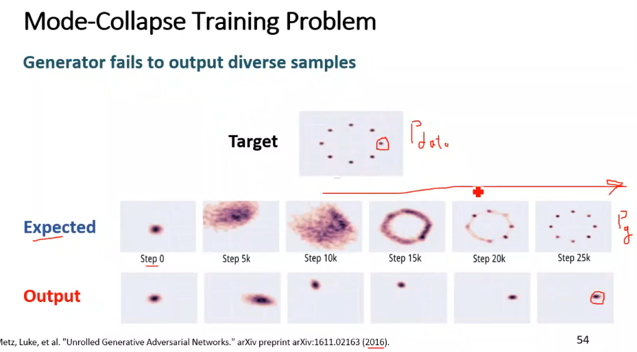
5) the Distribution divergence formula can make very big difference in the training
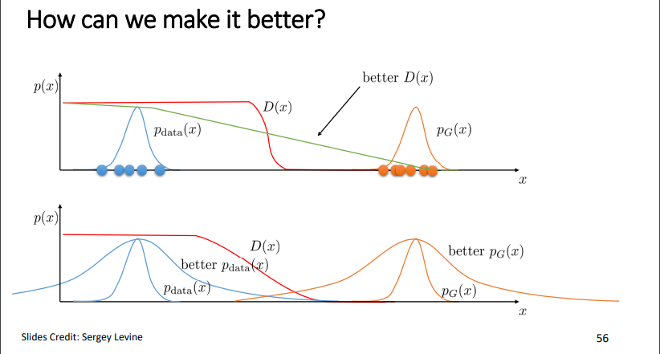
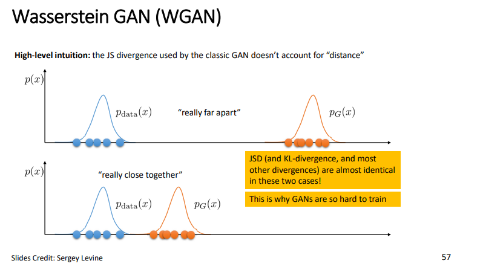
-> solution
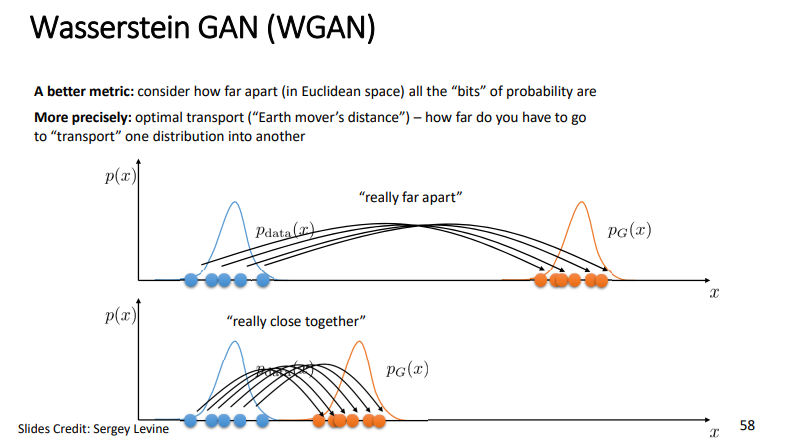

[[pros and cons]]
### [[GAN Improvements]]
