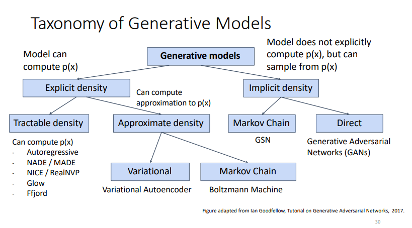

estimates the probability distribution function, then sample from it to generate a new image from that class
it's hard as the data 'p(x)' takes any shape i.e. very complicated 
like in bayes classifier where it assumes that the data follow a distribution p(x)

conditional is a mix of the two

[[generative models usage]]
[[generative advantages]]
[[generative disadvantages]]
[[latent variable models]]

#web 
### The main difference between generative and conditional models is how they are trained and how they generate or predict outputs:

Generative Models:
- Are trained **ONLY on samples** from the data distribution (e.g. images) without additional condition/context. 
- Learn the underlying distribution that generated the data.
- Can generate new samples from the same distribution (e.g. generate new images similar to those in the training set).

	Examples: Variational Autoencoders (VAEs), Generative Adversarial Networks (GANs)

Conditional Models:  
- Are trained on **samples paired with some condition or context** (e.g. images labeled with class).
- Learn the conditional distribution p(output | condition). 
- Generate/predict outputs conditioned on some input condition/context.

Examples: 
- Conditional GANs: Generate images conditioned on class.
- Text-to-image models: Generate images conditioned on text descriptions.
- Machine translation: Translate text conditioned on input language.

Key Differences:
- Generative models focus only on the data distribution, conditionals models model conditional distributions.
- Generatives can generate new samples, conditionals need context to generate/predict. 
- Conditionals are more flexible/controlable as they can be steered by context inputs.

So in summary, generative models explicitly model the inherent data distribution, while conditional models learn relationships between inputs and outputs.

### types

[[Autoencoder Variational]]
[[GANs]] 

[[generative dist info]]
