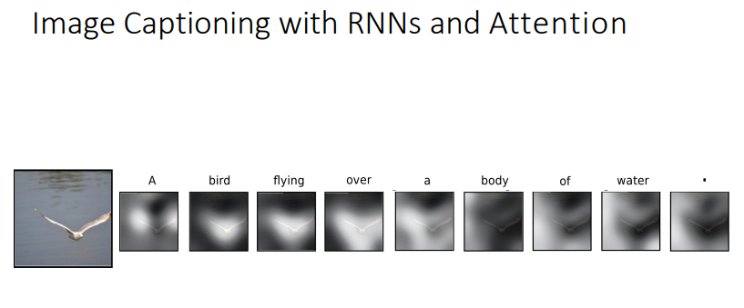

* attention for each word in output come from what in the input
* remove overhead on decoder 
* is where to look for late words to get the corresponding relevant inputs

#web 
This model allows an RNN to pay attention to specific parts of the input that is considered as being important, which improves the performance of the resulting model in practice. By noting $\alpha^{< t, t'>}$ the amount of attention that the output $y^{< t >}$ should pay to the activation $a^{< t' >}$ and $c^{< t >}$ the context at time $t$, we have:

${c^{< t >}=\sum_{t'}\alpha^{< t, t' >}a^{< t' >}}\quad\textrm{with}\quad\sum_{t'}\alpha^{< t,t' >}=1$ 

Remark: the attention scores are commonly used in image captioning and machine translation.
Attention weight -- The amount of attention that the output $y^{< t >}$ should pay to the activation $a^{< t' >}$ is given by $\alpha^{< t,t' >}$ computed as follows:

$\alpha^{< t,t' >}=\frac{\exp(e^{< t,t' >})}{\displaystyle\sum_{t''=1}^{T_x}\exp(e^{< t,t'' >})}$

Remark: computation complexity is quadratic with respect to $T_x$.

MLP: multi layer perceptron (NN)

$c_t$ helps with long sequences

### advantages
Interpretability 

### examples

Each timestep of decoder uses a different context vector that looks at different parts of the input image

