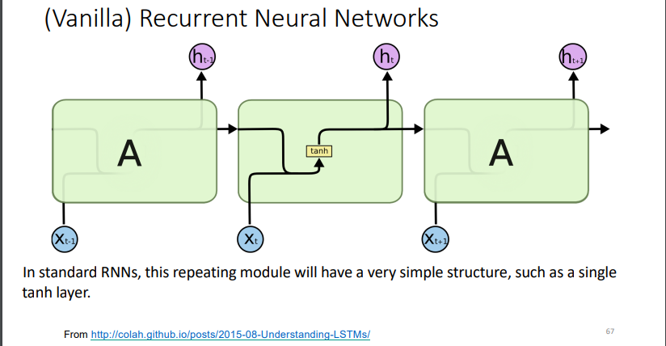
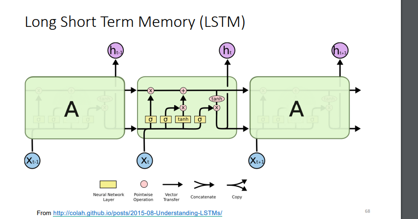
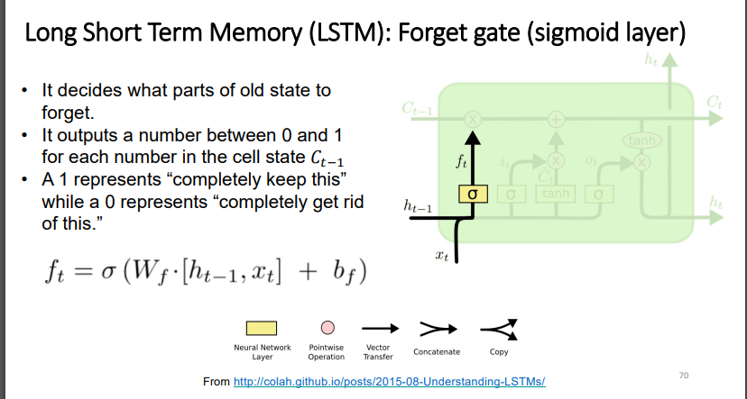
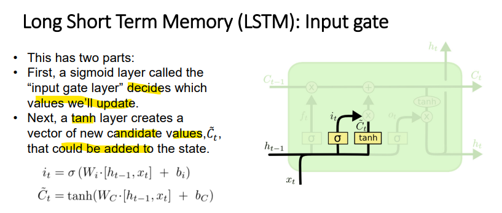
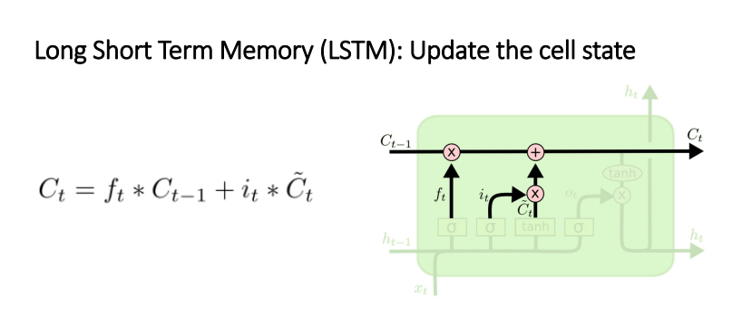
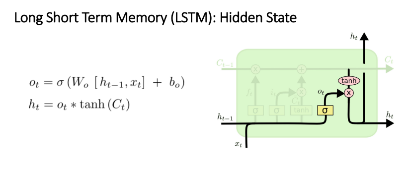
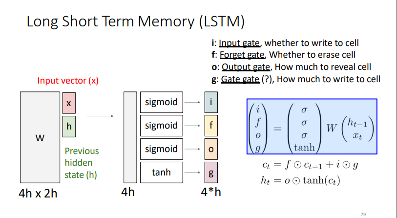
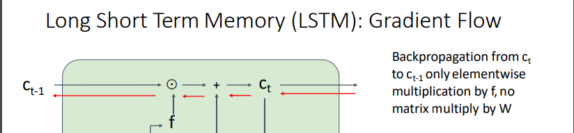
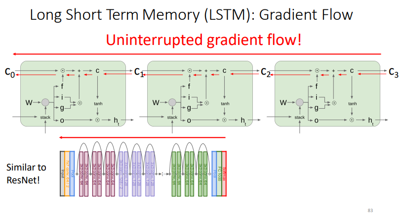

change the vanilla arch to have multi paths for gradient to  overcome the vanishing gradient

->

key differences:
add two sources of history ( Cell history c, history h)

the new "cell state" channel -> made The LSTM have the ability to remove or add information to the cell state using gates

$i_t$ is the output of sigmoid it decides what parts of the current history to take from $\tilde{C}_t$
$f_t$ decides the previous cell history 
then update
 

*_Decide what to output based on the memory._

[[LSTM types]]

### summary

### training gradient flow

