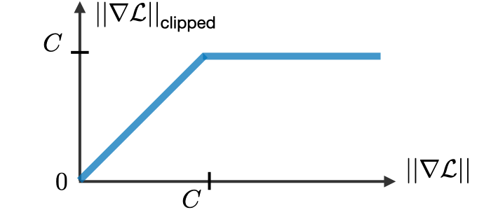

RNN: 
 * advantages:
	 * Can process input variable lengths
	 * Model size (paraments)(as shared weights) not increasing with size of input
	 * shared weights ->  weights are applied at every time step of the input, so there is symmetry in how inputs are processed
	 * Computation takes into account historical information (history)
* disadvantages:
	* Vanishing/exploding gradients make it hard to train on long sequences
	* Limited Context (history): Difficulty of accessing information from a long time ago
	* Sequential Processing
	* Due to its recurrent nature, the computation is slow. Training of RNN models can be difficult

LSTM: 
* advantages:
	* by the cell gating mechanism
		* No vanishing gradient like RNN
		* learning long-term dependencies effectively
* disadvantages:
	* more complex and slower to learn due to the added gating complexity 
	* Difficulty in Interpretation due to the added inner gating complexity 

Attention: 
* advantages:
	* due attention mechanism
		* focus on relevant input parts
		* long sequences
		* Parallel processing
		* Interpretability
* disadvantages:
	* more complex and need training time

## RNN

+ Vanishing/exploding gradient The vanishing and exploding gradient phenomena are often encountered in the context of RNNs. The reason why they happen is that it is difficult to capture long term dependencies because of multiplicative gradient that can be exponentially decreasing/increasing with respect to the number of layers.
	+ solution for exploding gradient:
		+ Gradient clipping is used. By capping the maximum value for the gradient.
		+ Truncated Backpropagation (run in chunks)
	+ Vanishing gradients-> Change RNN architecture! to make the gradient path has more than one path with the weight vector W like ResNet

- **What is the loss function of a RNN?**
    Cross-entropy summed over a corpus of size T and a vocabulary of size V.
  
- **Give an example of the vanishing gradient problem in RNN and explain it.**
    
    > S1: 'Jane walked into the room. John walked in too. Jane said hi to _?_'.
    > 
    > S2: 'Jane walked into the room. John walked in too. It was late in the day, and everyone was walking home after a long day at work. Jane said hi to _?_'.
    
    In both cases, the RNN should predict John as an answer. However, in practice, it turns out the RNN is more likely to predict John in sentence 1 than in sentence 2. Indeed, during backpropagation, the contribution of gradient values **gradually vanishes as they propagate to earlier timesteps**. Thus for long sentences, the RNN is less likely to recall information introduced in the earliest part of a sentence.

- **How to solve vanishing gradient problem?**
    **Technique 1**: Instead of initializing W randomly, start off from an identity matrix initialization.
    
    **Technique 2**: Use ReLU as an activation function since the derivative of the gradient is either 0 or 1. This way, gradients would flow through the neurons whose derivatives is 1 without getting attenuated while propagating back through time-steps.
    
## 2. Seq2Seq models

- **What is the advantage of Seq2Seq models over regular RNNs?**
    Seq2Seq models can generate arbitrary output sequences after seeing the entire input. They can even focus in on specific parts of the input automatically to help generate a useful translation.
    E.g.: 1 encoder and 1 decoder (both LSTM or bi-LSTM)    

- **What does an encoder do in a Seq2Seq model?**
    It reads the input sequence and generate a fixed-dimensional context vector C for the sequence.
    
    The encoder stacks multiple RNNs on top of each other to effectively compress an arbitrary-length sequence into a fixed-size vector. The final layer's LSTM hidden state will be used as a context vector

- **What does a decoder do in a Seq2Seq model?**
    It uses the context vector as a _'seed'_ from which to generate an output sequence.

- **How does a decoder work in a Seq2Seq model?**
    
    We initialize the hidden state of our first layer with the context vector, we then pass an token appended to the end of the input. We then run the three-stacked RNN, following up with a softmax on the final layer's output to generate the first word.
    

## 3 Attention mechanism
* attention for each word in output come from what in the input
* remove overhead on decoder 
* is where to look for late words to get the corresponding relevant inputs

#web 
This model allows an RNN to pay attention to specific parts of the input that is considered as being important, which improves the performance of the resulting model in practice. By noting $\alpha^{< t, t'>}$ the amount of attention that the output $y^{< t >}$ should pay to the activation $a^{< t' >}$ and $c^{< t >}$ the context at time $t$, we have:

${c^{< t >}=\sum_{t'}\alpha^{< t, t' >}a^{< t' >}}\quad\textrm{with}\quad\sum_{t'}\alpha^{< t,t' >}=1$ 

Remark: the attention scores are commonly used in image captioning and machine translation.
Attention weight -- The amount of attention that the output $y^{< t >}$ should pay to the activation $a^{< t' >}$ is given by $\alpha^{< t,t' >}$ computed as follows:

$\alpha^{< t,t' >}=\frac{\exp(e^{< t,t' >})}{\displaystyle\sum_{t''=1}^{T_x}\exp(e^{< t,t'' >})}$

Remark: computation complexity is quadratic with respect to $T_x$.

- **Why do we need attention mechanism?**
    Some words convey more information than others, hence requires more attention. Thus, there is a flaw in using the final RNN hidden state as a context vector: different parts of the input have different levels of significance. Moreover, different parts of the output may even consider different parts of the input _'important'_.
    
    _E.g._: The ball is on the field.
    
    Most important words: ball, on, field.

- **What is global attention?**
    
    Instead of giving to the decoder's LSTM cells a single context vector which is a weighted average of all the hidden states of the encoder (attention). LSTM cells in the decoder are fed with the **concatenation** of the encoder hidden states at time i and the context vector.
    

- **Give 4 algorithms that can be used by decoders to search translations.**
    
    Exhaustive search, ancestral sampling, greedy search, beam search
    
