no. of inputs and outputs determines the application 
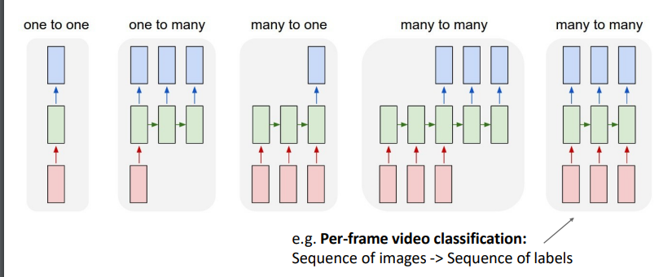

one to one : e.g. Image classification Image ‐> Label
one to many: e.g. Image Captioning: Image ‐> sequence of words,,, Music generation
many to one: e.g. Video classification: Sequence of images ‐> label
many to many: e.g. Machine Translation: Sequence of words ‐> Sequence of words
but it computed as one network (i.e. not encoder decoder arch.)

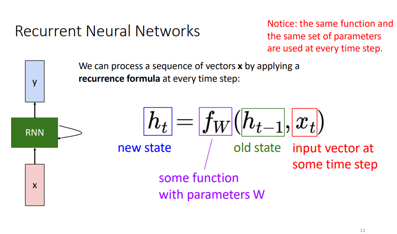
Key idea: RNNs have an “internal state” that is updated as a sequence is processed
old state has the history from the beginning till the last state
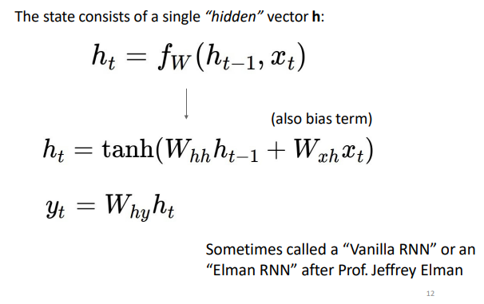

Initial hidden state Either set to all 0, Or learn it

Re‐use the same weight matrix at every time‐step
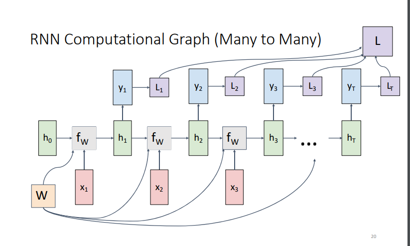
L is the loss
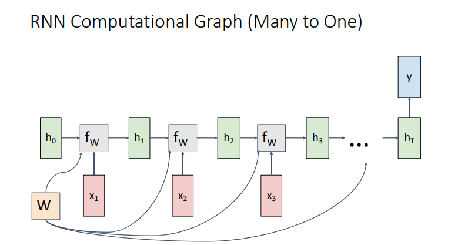

### the second method SEQ to SEQ
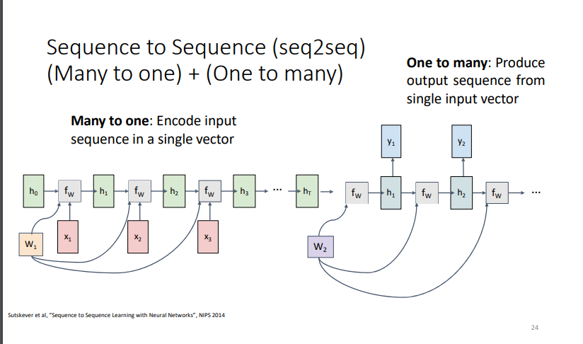
like encoder decoder arch

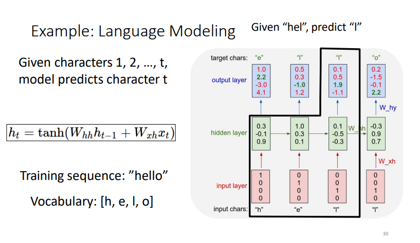
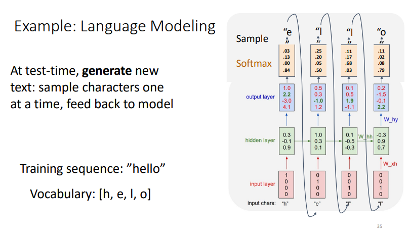

### backpropagation
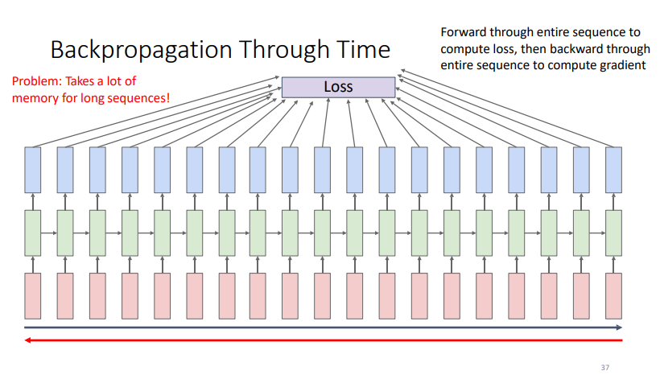
-> solution
Run forward and backward through chunks of the sequence instead of whole sequence
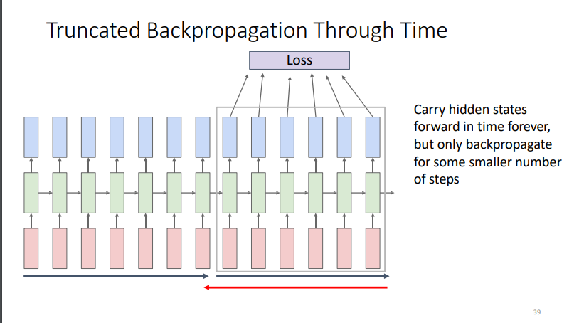

### multi-model
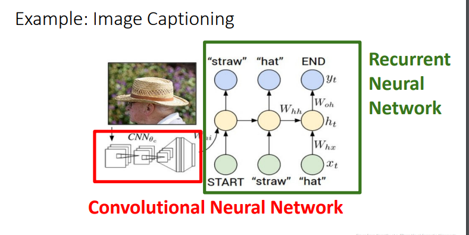
Transfer learning: Take CNN trained on ImageNet, chop off last layer
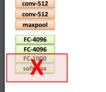
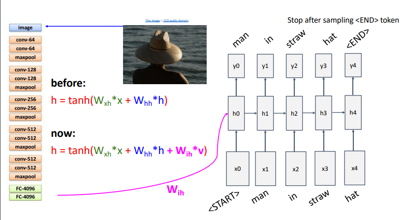
Sample word and copy to input till the end of sequence

### normal prediction - backpropagation flow
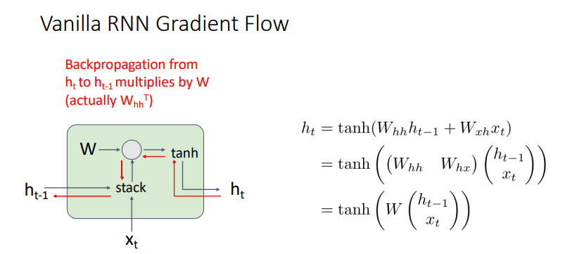
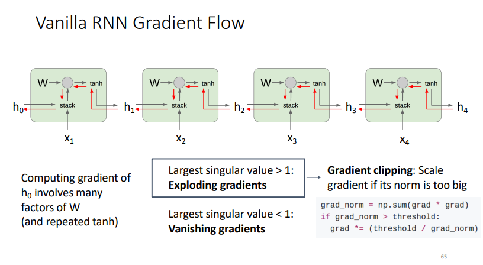

Vanishing gradients-> Change RNN architecture!

[[NLP cheat sheet]]
