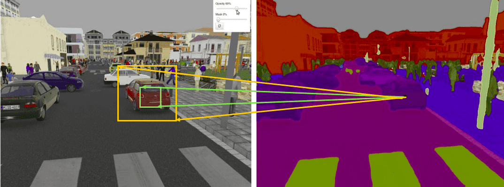
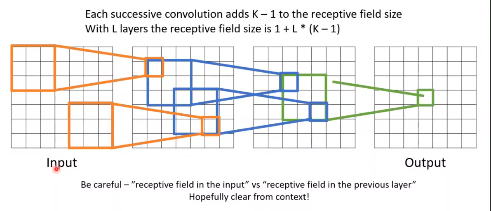

We define the **neuron’s receptive field** as **the patch** of the total field of view. In other words, **what information a single neuron has access to**
Basically, it is a measure of association of an output feature (of any layer) to the input **region** (patch)
why? 
Ideally, we would like each output pixel of the label map to have a big receptive field, so as to ensure that no crucial information was **not** taken into account.

Therefore, our goal is to design a convolutional model so that we ensure that **its RF covers the entire relevant input image region**

|   |   |   |   |
|---|---|---|---|
||**CONV**|**POOL**|**FC**|
|**Illustration**||||
|**Input size**|$I \times I \times C$|$I \times I \times C$|$N_{\text{in}}$|
|**Output size**|$O \times O \times K$|$O \times O \times C$|$N_{\text{out}}$|
|**Number of parameters**|$(F \times F \times C + 1) \cdot K$|$0$|$(N_{\text{in}} + 1 ) \times N_{\text{out}}$|
|**Remarks**|• One bias parameter per filter   • In most cases, $S < F$   • A common choice for $K$ is $2C$|• Pooling operation done channel-wise   • In most cases, $S = F$|• Input is flattened   • One bias parameter per neuron   • The number of FC neurons is free of structural constraints|

  

Receptive field -- The receptive field at layer $k$ is the area denoted $R_k \times R_k$ of the input that each pixel of the $k$-th activation map can 'see'. By calling $F_j$ the filter size of layer $j$ and $S_i$ the stride value of layer $i$ and with the convention $S_0 = 1$, the receptive field at layer $k$ can be computed with the formula: $R_k = 1 + \sum_{j=1}^{k} (F_j - 1) \prod_{i=0}^{j-1} S_i$
_In the example below, we have $F_1 = F_2 = 3$ and $S_1 = S_2 = 1$, which gives $R_2 = 1 + 2\cdot 1 + 2\cdot 1 = 5$._

multi resolution
fine details ---> big picture (combinations from previous values)

## How can we increase the receptive field in a convolutional network?

In essence, there are a plethora of ways and tricks to increase the RF, that can be summarized as follows:

1. Add more convolutional layers (make the network deeper)
2. Add pooling layers or higher stride convolutions (sub-sampling)
3. Use [dilated convolutions](https://www.reddit.com/r/MachineLearning/comments/52drsq/what_is_dilated_convolution/) , https://www.educative.io/answers/what-is-dilated-convolution
5. Depth-wise convolutions    

Let’s look at the **distinct characteristics** of these approaches.

https://theaisummer.com/receptive-field/

#### Layer Sizing Patterns

Until now we’ve omitted mentions of common hyperparameters used in each of the layers in a ConvNet. We will first state the common rules of thumb for sizing the architectures and then follow the rules with a discussion of the notation:

The **input layer** (that contains the image) should be divisible by 2 many times. Common numbers include 32 (e.g. CIFAR-10), 64, 96 (e.g. STL-10), or 224 (e.g. common ImageNet ConvNets), 384, and 512.

The **conv layers** should be using small filters (e.g. 3x3 or at most 5x5), using a stride of S=1�=1, and crucially, padding the input volume with zeros in such way that the conv layer does not alter the spatial dimensions of the input. That is, when F=3�=3, then using P=1�=1 will retain the original size of the input. When F=5�=5, P=2�=2. For a general F�, it can be seen that P=(F−1)/2�=(�−1)/2 preserves the input size. If you must use bigger filter sizes (such as 7x7 or so), it is only common to see this on the very first conv layer that is looking at the input image.

The **pool layers** are in charge of downsampling the spatial dimensions of the input. The most common setting is to use max-pooling with 2x2 receptive fields (i.e. F=2�=2), and with a stride of 2 (i.e. S=2�=2). Note that this discards exactly 75% of the activations in an input volume (due to downsampling by 2 in both width and height). Another slightly less common setting is to use 3x3 receptive fields with a stride of 2, but this makes “fitting” more complicated (e.g., a 32x32x3 layer would require zero padding to be used with a max-pooling layer with 3x3 receptive field and stride 2). It is very uncommon to see receptive field sizes for max pooling that are larger than 3 because the pooling is then too lossy and aggressive. This usually leads to worse performance.

_Reducing sizing headaches._ The scheme presented above is pleasing because all the CONV layers preserve the spatial size of their input, while the POOL layers alone are in charge of down-sampling the volumes spatially. In an alternative scheme where we use strides greater than 1 or don’t zero-pad the input in CONV layers, we would have to very carefully keep track of the input volumes throughout the CNN architecture and make sure that all strides and filters “work out”, and that the ConvNet architecture is nicely and symmetrically wired.

_Why use stride of 1 in CONV?_ Smaller strides work better in practice. Additionally, as already mentioned stride 1 allows us to leave all spatial down-sampling to the POOL layers, with the CONV layers only transforming the input volume depth-wise.

_Why use padding?_ In addition to the aforementioned benefit of keeping the spatial sizes constant after CONV, doing this actually improves performance. If the CONV layers were to not zero-pad the inputs and only perform valid convolutions, then the size of the volumes would reduce by a small amount after each CONV, and the information at the borders would be “washed away” too quickly.

_Compromising based on memory constraints._ In some cases (especially early in the ConvNet architectures), the amount of memory can build up very quickly with the rules of thumb presented above. For example, filtering a 224x224x3 image with three 3x3 CONV layers with 64 filters each and padding 1 would create three activation volumes of size [224x224x64]. This amounts to a total of about 10 million activations, or 72MB of memory (per image, for both activations and gradients). Since GPUs are often bottlenecked by memory, it may be necessary to compromise. In practice, people prefer to make the compromise at only the first CONV layer of the network. For example, one compromise might be to use a first CONV layer with filter sizes of 7x7 and stride of 2 (as seen in a ZF net). As another example, an AlexNet uses filter sizes of 11x11 and stride of 4.