|   |   |
|---|---|
|**Advantages**|**Drawbacks**|
|• Possibility of processing input of any length   • Model size not increasing with size of input   • Computation takes into account historical information   • Weights are shared across time|• Computation being slow   • Difficulty of accessing information from a long time ago   • Cannot consider any future input for the current state|

+ Vanishing/exploding gradient The vanishing and exploding gradient phenomena are often encountered in the context of RNNs. The reason why they happen is that it is difficult to capture long term dependencies because of multiplicative gradient that can be exponentially decreasing/increasing with respect to the number of layers.
+ Gradient clipping is a technique used to cope with the exploding gradient problem sometimes encountered when performing backpropagation. By capping the maximum value for the gradient, this phenomenon is controlled in practice.

- **How does a RNN solve the curse of dimensionality problem incurred by n-gram language models?**
    
    It is solved since the weight matrices are applied at every step of the network. Hence the model parameters don't grow proportionally to the input sequence size. The number of parameters is independent of the sequence length.
    

- **What is the loss function of a RNN?**
    
    Cross-entropy summed over a corpus of size T and a vocabulary of size V.

- **What are advantages of RNN?**
    - They can process input sequences of any length
    - The model size does not increase for longer input sequence lengths
    - The same weights are applied at every time step of the input, so there is symmetry in how inputs are processed

- **Give an example of the vanishing gradient problem in RNN and explain it.**
    
    > S1: 'Jane walked into the room. John walked in too. Jane said hi to _?_'.
    > 
    > S2: 'Jane walked into the room. John walked in too. It was late in the day, and everyone was walking home after a long day at work. Jane said hi to _?_'.
    
    In both cases, the RNN should predict John as an answer. However, in practice, it turns out the RNN is more likely to predict John in sentence 1 than in sentence 2. Indeed, during backpropagation, the contribution of gradient values **gradually vanishes as they propagate to earlier timesteps**. Thus for long sentences, the RNN is less likely to recall information introduced in the earliest part of a sentence.
    

- **How to solve vanishing gradient problem?**
    
    **Technique 1**: Instead of initializing W randomly, start off from an identity matrix initialization.
    
    **Technique 2**: Use ReLU as an activation function since the derivative of the gradient is either 0 or 1. This way, gradients would flow through the neurons whose derivatives is 1 without getting attenuated while propagating back through time-steps.
    

- **What are exploding gradients and give a technique on how to solve them?**
    
    The explosion occurs through exponential growth by repeatedly multiplying gradients through the network layers that have values larger than 1.0.
    
    A technique to solve exploding gradients is gradient clipping. Gradient clipping is a simple heuristic invented by Thomas Mikolov to counter the effect of exploding gradient. That is, whenever the gradient reach a certain threshold, they are set back to a small number.
[[cheatsheet]]

no. of inputs and outputs determines the application 
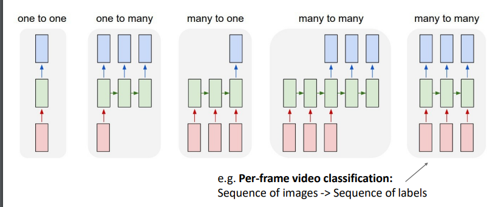

one to one : e.g. Image classification Image ‐> Label
one to many: e.g. Image Captioning: Image ‐> sequence of words,,, Music generation
many to one: e.g. Video classification: Sequence of images ‐> label
many to many: e.g. Machine Translation: Sequence of words ‐> Sequence of words
but it computed as one network (i.e. not encoder decoder arch.)

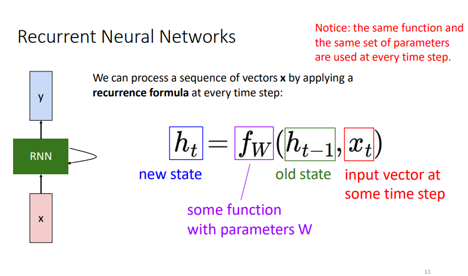
Key idea: RNNs have an “internal state” that is updated as a sequence is processed
old state has the history from the beginning till the last state
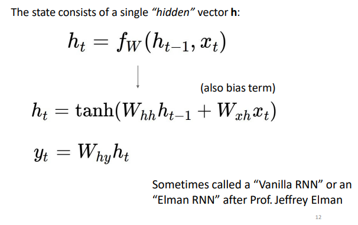

Initial hidden state Either set to all 0, Or learn it

Re‐use the same weight matrix at every time‐step
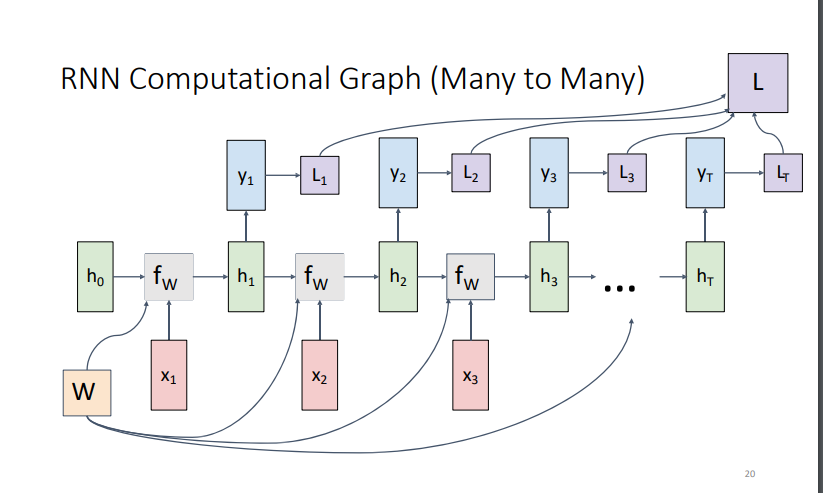
L is the loss
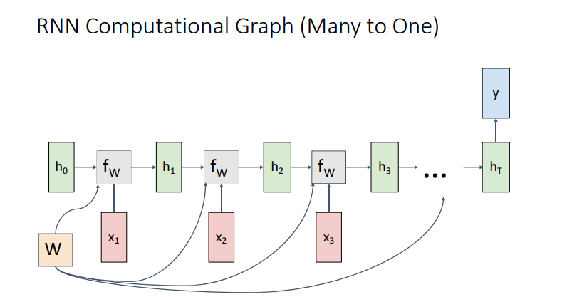
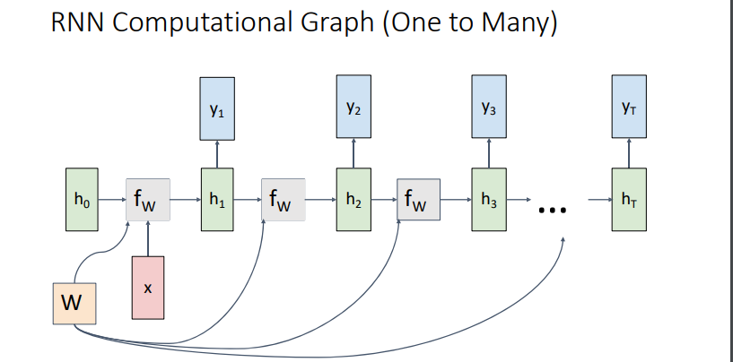

### the second method SEQ to SEQ
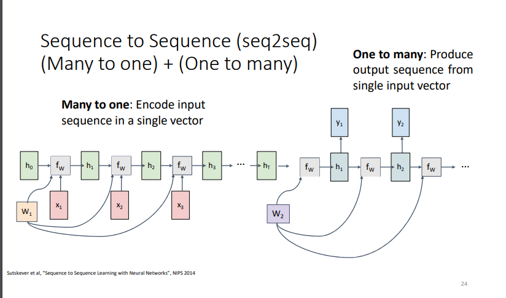
like encoder decoder arch

* disadvantages:

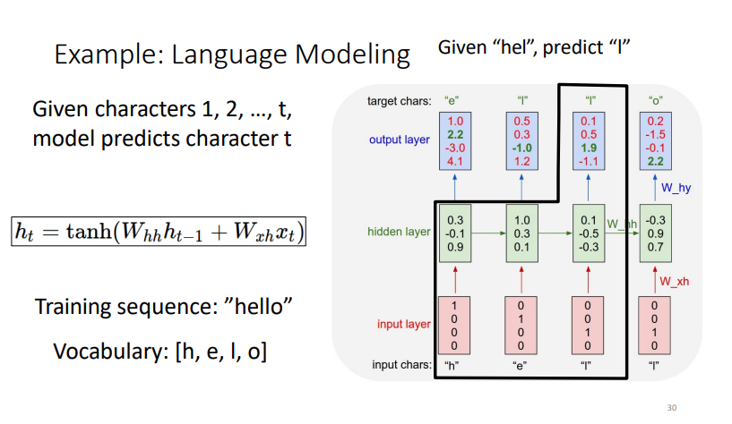
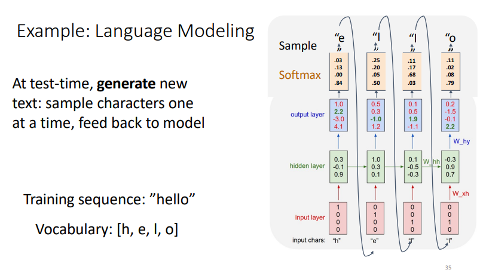

### backpropagation
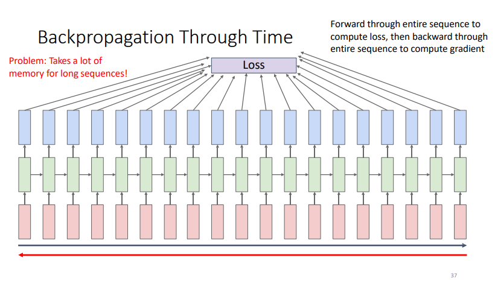
-> solution
Run forward and backward through chunks of the sequence instead of whole sequence
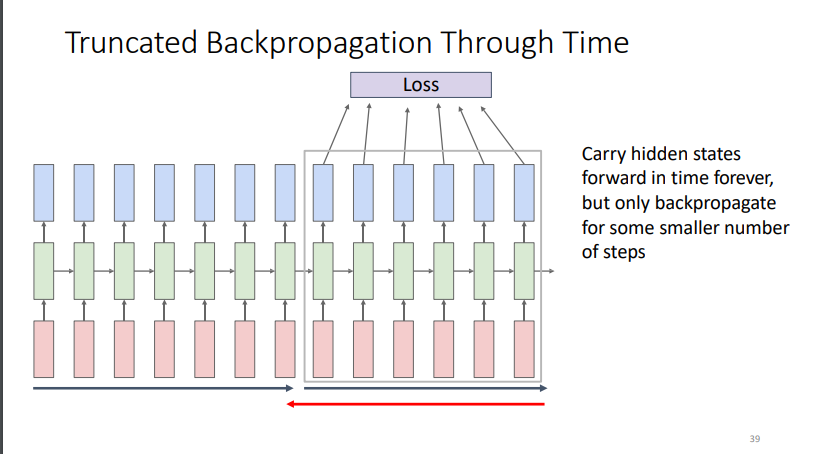

### multi-model
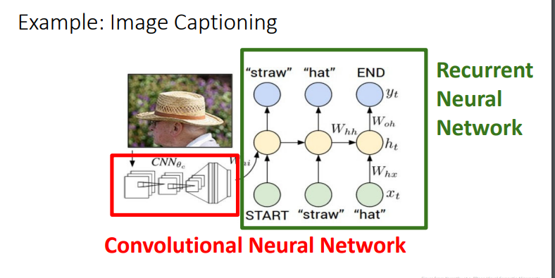
Transfer learning: Take CNN trained on ImageNet, chop off last layer
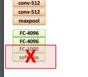
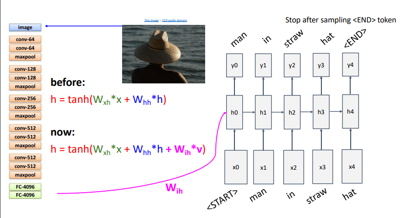
Sample word and copy to input till the end of sequence

### normal prediction - backpropagation flow
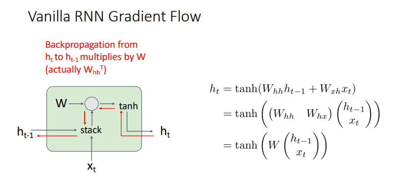
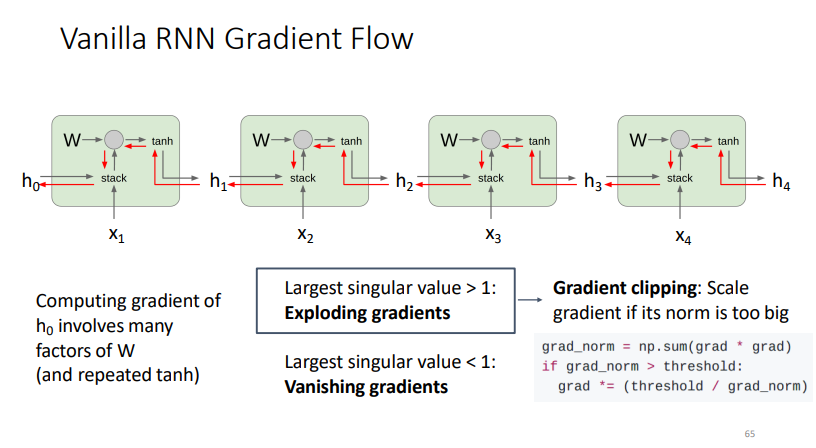

Vanishing gradients-> Change RNN architecture!