generalize not overfit (memorize)

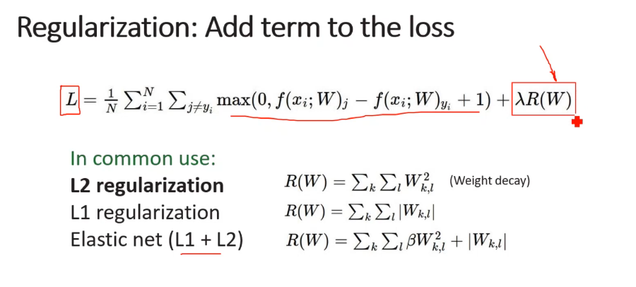

Dropout: In each forward pass, randomly set some neurons to zero Probability of dropping is a hyperparameter; 0.5 is common

at testing:
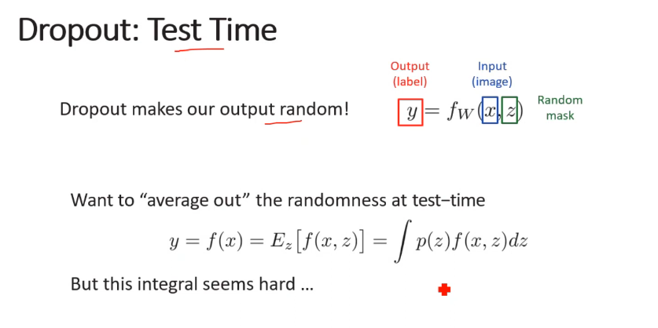
P() * output
**non linear** operation at training, but **linear** at testing 
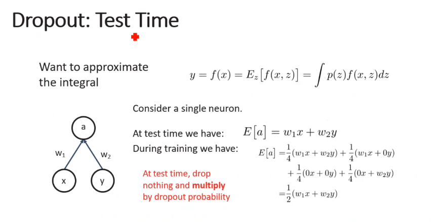

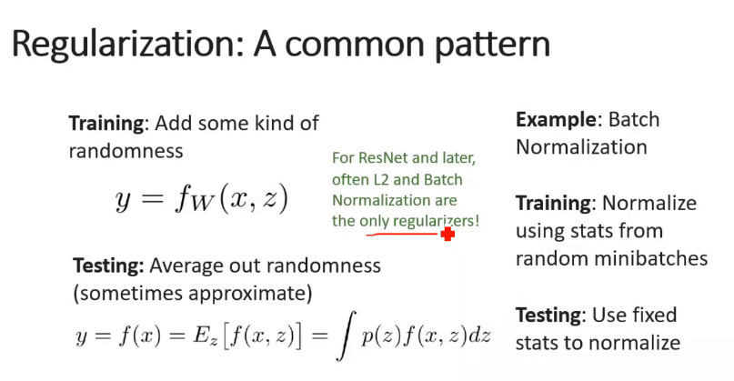

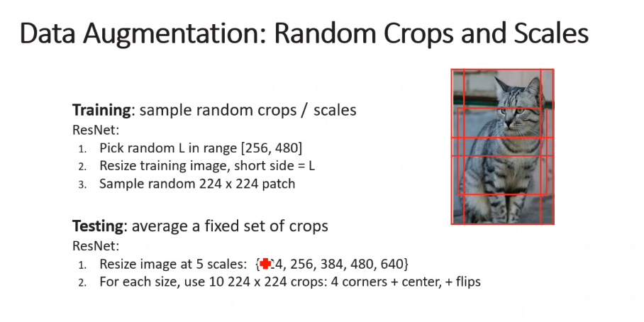
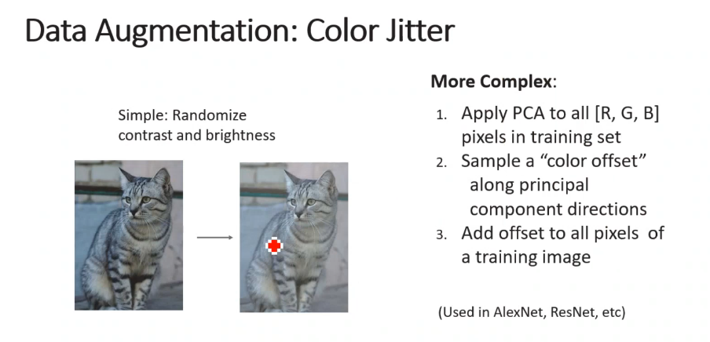
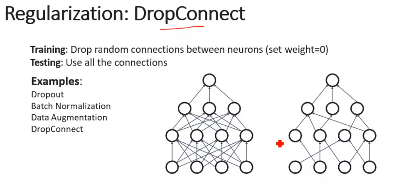
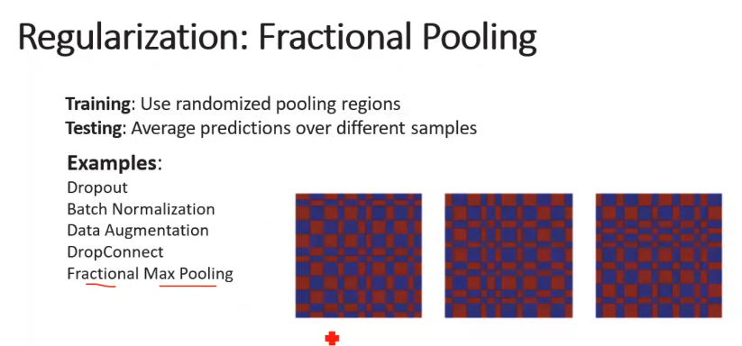
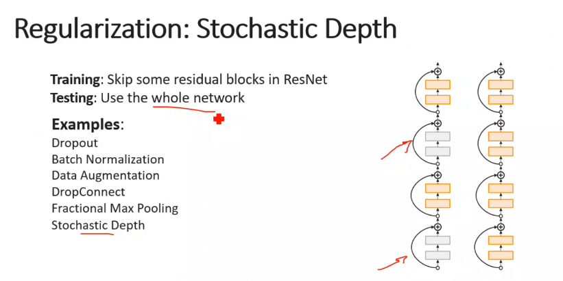
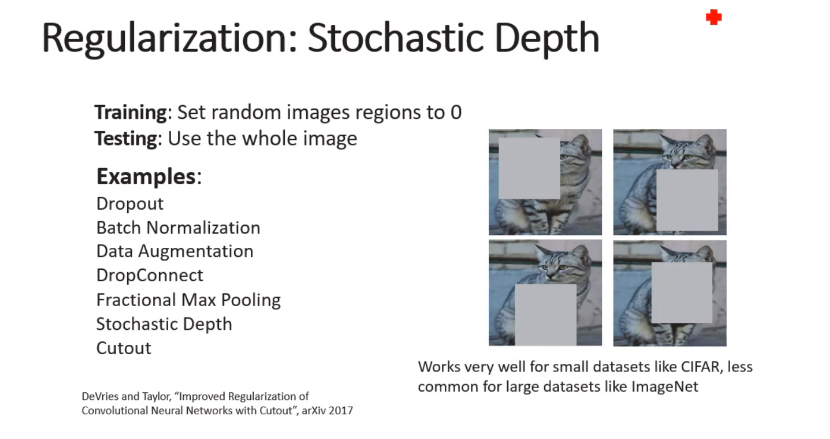
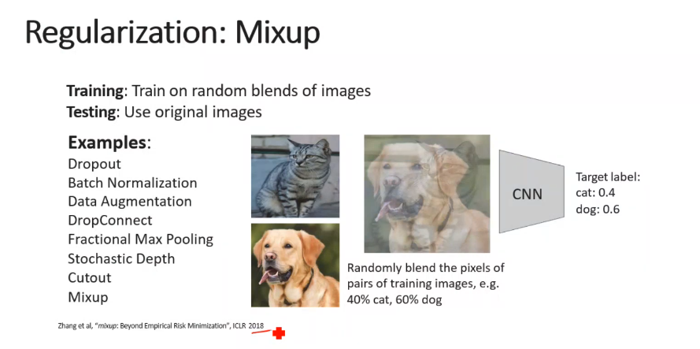
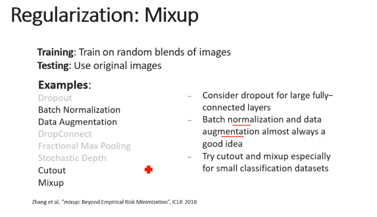

