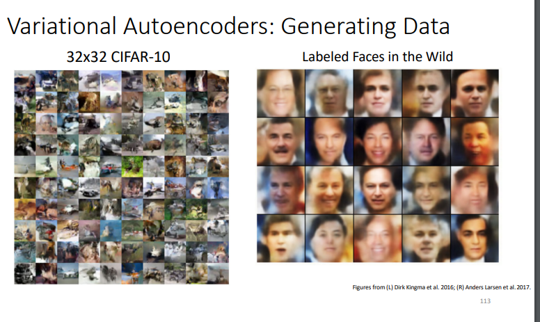
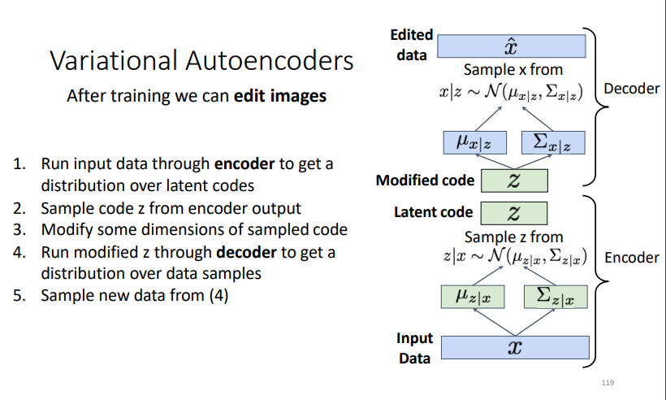
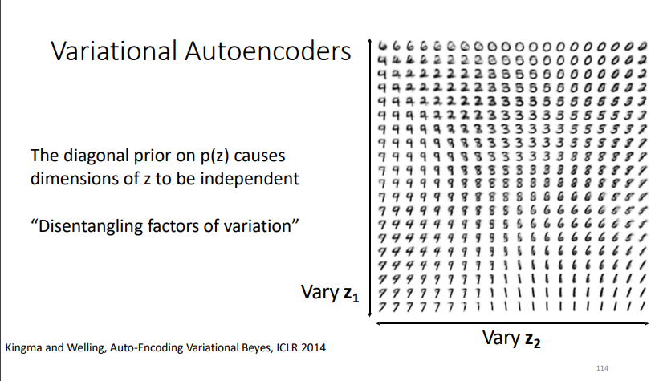
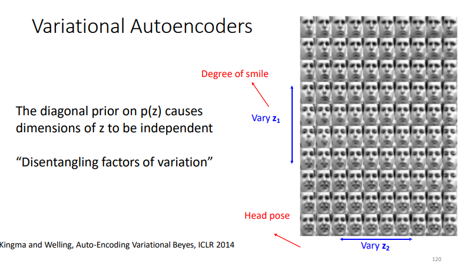
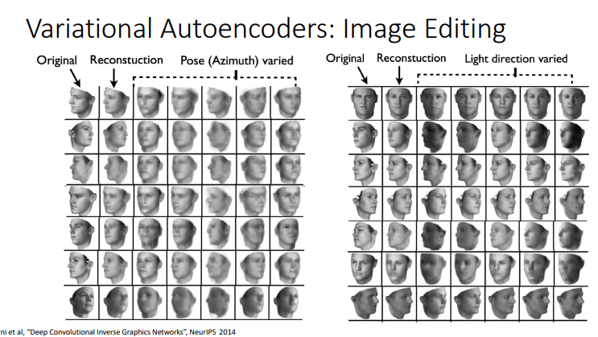

to know which feature is responsible for the hair, age …

continuously grid search (sample neighboring points in the z vector) with two features ( z1, z2) and generate the image to know what feature it represents 

