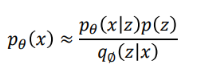
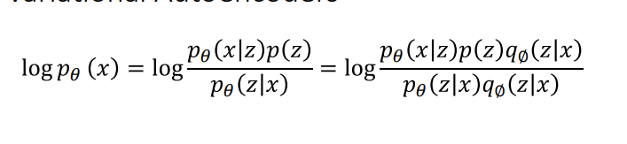
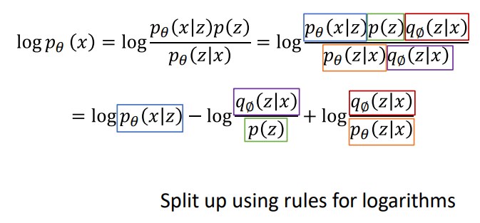
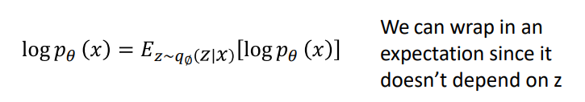
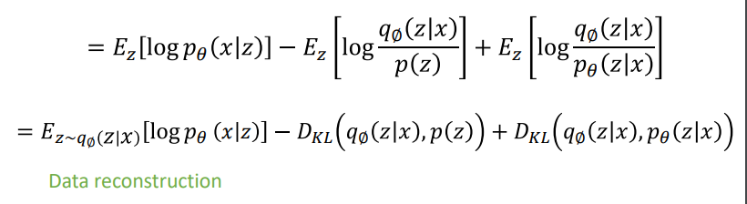
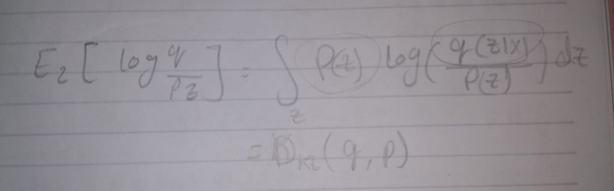
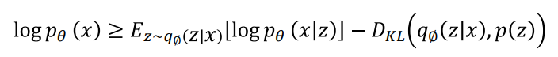

as we're using **maximum likelihood**  we want to maximize the 

take log (any monotonic function doesn't change the data behavior) so maximize the log is the same 
using bayes rule

Multiply top and bottom by q(z l x)

get the expectation

as LHS doesn't depend on z

recall from [[Distribution formulas]]

1st term is Data reconstruction operation
	takes x and outputs the z (decoder ???)

2nd term is KL divergence between prior, and samples from the encoder network 

3rd term is KL divergence between encoder and posterior of decoder
	hard to compute
-> solution: KL is >= 0, so dropping this term gives a lower bound on the data likelihood:

we don't know how to maximize the LHS but we can with the RHS

