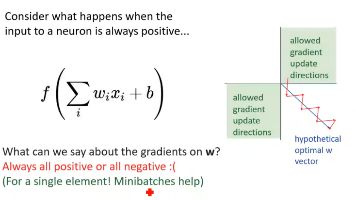
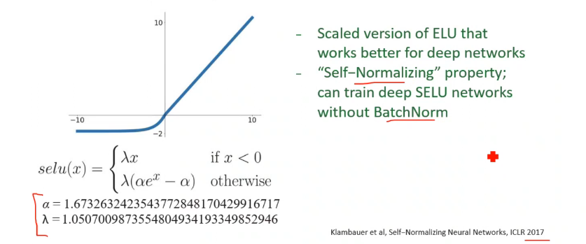

sigmoid 
- + Squashes numbers to range [0,1] (sort of normalization)
- + Historically popular since they have nice interpretation as a saturating "firing rate" of a neuron
- - exp() is a bit compute expensive
- - kill gradient (slope =0 for |big numbers| )
- - Sigmoid outputs are not zero-centered (all are positive)

tanh
- + Squashes numbers to range [-1,1]
- + zero centered (nice)
- - still kills gradients when saturated :(

Relu
- + Does not saturate (in +region)
- + Very computationally efficient
- + Converges much faster than sigmoid/tanh in practice (e.g. 6x)
- - kill gradient (slope =0 for neg numbers )

Leaky ReLU, Exponential Linear Unit (ELU)
- + gradient will not "die"

Scaled Exponential Linear Unit (SELU)

	+ its always a plus to add the non linearity, and multi functionility in other layers

