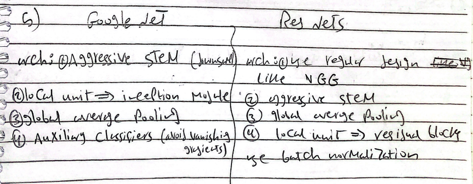
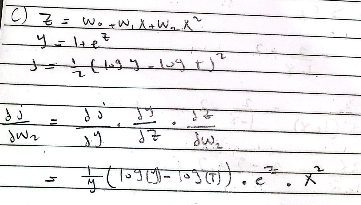
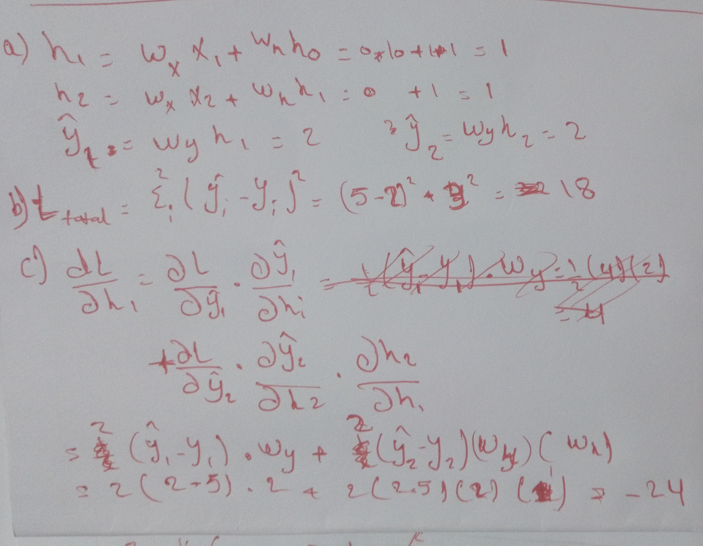

### Q1

==Q1==
**The model will not generalize well to unseen data because it overfits the test set**

First, the same data is used for both training and hyperparameter tuning. The goal of hyperparameter tuning is to select hyperparameters that will give good generalization performance. Typically, this works by estimating the generalization performance for different choices of hyperparameters (e.g. using a validation set), and then choosing the best. But, as above, this estimate will be overoptimistic if the same data has been used for training. The consequence is that sub-optimal hyperparameters will be chosen. In particular, there will be a bias toward high capacity models that will overfit

Second, data that has already been used to tune hyperparameters is being re-used to estimate performance. This will give a deceptive estimate, as above. This isn't overfitting itself but it means that, if overfitting is happening (and it probably is, as above), then you won't know it.

The remedy is to use three separate datasets: a training set for training, a validation set for hyperparameter tuning, and a test set for estimating the final performance. Or, use nested cross validation, which will give better estimates, and is necessary if there isn't enough data.

==-> data leakage, and overfits on the test data==

Q2
make the network not rely solely on specific neurons(features) and distribute its weight on them acting like taking the average like L2

dropout: Probabilistically dropping out nodes from a NN layer making the model smaller "simpler" in the ==training== stage only, thus making the output more like an average 
	- When we drop different sets of neurons, it’s equivalent to training different neural networks (ensemble). The different networks will overfit in different ways, so the net effect of dropout will be to reduce overfitting

when should use it
* overfitting
* after a Dense (fully connected) layer or in very complex deep network that may overfit 

Q3
H = W = (128 -7 +2x3)/2 +1 = 64.5 = 64
D = 64x64x128

Q4
getting good signal of loss (gradients) to train the network (converge to solution) effectively and quickly
maintain the weights without vanishing or exploding 

Q5

Q6
9x9

Q7
yellow: very high
green: high
red: optimal
blue: low 

Q8
batch normalization at training is a non linear operation
but in testing is linear
### Q2

Q1:
D job is to classify input images x as either 0 = absolute fake or 1 = absolute real
it should classify real images from the dataset as 1 or highest
it should classify generated images from Generator as 0 or lowest

Q2:
the discriminator should output values close to 0.5 for both real and generated data. If D(G(z)) is close to 1, it means the discriminator is confidently classifying the generated samples as real, which indicates that the generator has not yet learned to generate realistic data. Conversely, if D(G(z)) is close to 0, it means the discriminator is confidently classifying the generated samples as fake, indicating that the generator is producing poor-quality data.

Q3

### Q3

### Q4

q1: True-> if $\gamma$ small it will easily take 
if $\gamma$ is big it will ignore the near small reward and try to finalize the game

In a Markov decision process (MDP), the discount factor γ weights the importance of immediate rewards versus future rewards. A smaller discount factor like γ < 1 places more emphasis on rewards received in the near term, rather than far in the future.

Mathematically, the discounted return Rt = rt + γrt+1 + γ^2rt+2 + ... decreases in value more rapidly as the rewards rt, rt+1, etc become further from the current time step t.

So with a small γ close to 0, rewards just a few time steps in the future contribute very little to the overall return. The optimal policy will then favor actions that maximize immediate rewards over long term outcomes.

In contrast, a larger discount factor like γ ≈ 1 considers rewards over a much longer horizon approximately equally. This shifts focus toward choices with possibly better long run effects, even if short term rewards are somewhat lower.

