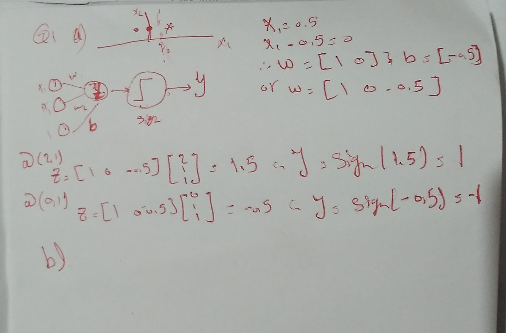
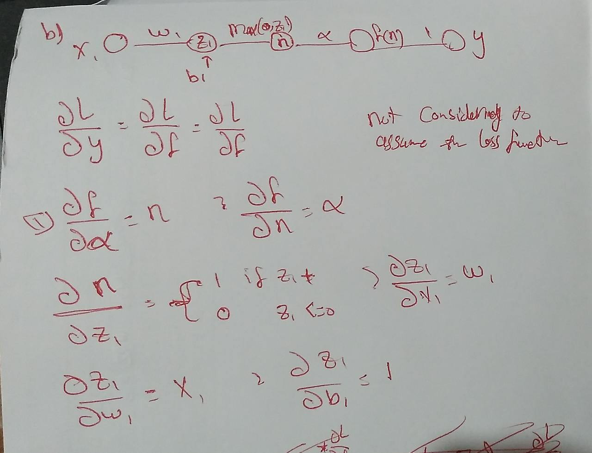
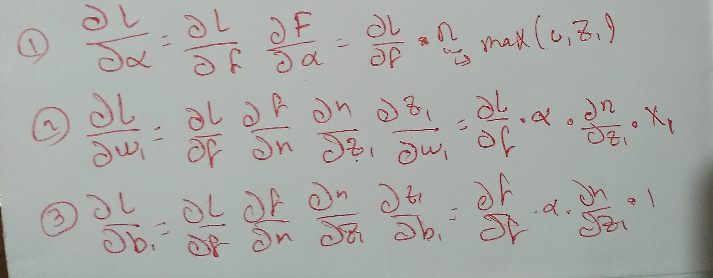
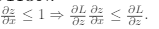
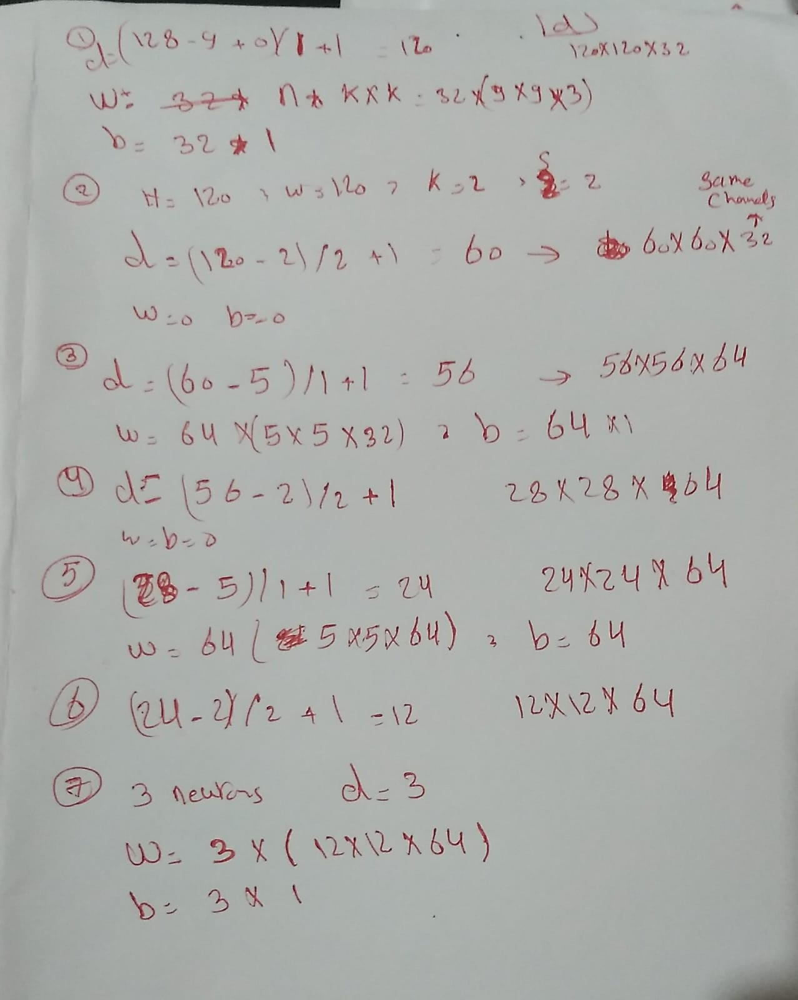

### Q1
Q1:

==Q2== !!!

### Q2:
Q1: 
initializing all weights to zeros in forward propagation will lead to zero outputs and in backward 
it does not break the symmetry. All hidden units will have identical influence on the cost, which will lead to identical gradients. Thus, both neurons will evolve symmetrically throughout training, effectively preventing different neurons from learning different things.

Q2:

### Q3:
q1:
- Improper initialization:
	- Weights are initialized too small: If the initial weights are very close to zero, the network output won't change much from input to output, causing a flat loss. Larger initial weights are needed.
	- If weights are initialized to all be the same value, the network won't train since it can't create distinct pathways. Proper random initialization helps.

- preprocessing:
	- Input/output scaling mismatch: If the inputs and outputs are on drastically different scales (e.g. inputs 0-1, outputs 0-10000), it will be difficult for weights to learn at first. Normalization can help. 

- Saturated nonlinearities: If the activation ranges (e.g. tanh, sigmoid) are causing saturated values even at initialization, gradients will be almost zero. Using ReLU or other unsaturated nonlinearities helps.

- Very deep network: A deep network with identity/linear mappings (activation) between layers could act like a single linear model at initialization, resulting in a flat loss.

- The chosen network architecture is too shallow, simple or lacks the necessary complexity to capture the underlying patterns in the data, it may struggle to learn and result in a flat loss function.

- Insufficient Training Data: If the training dataset is too small or lacks diversity, the network may struggle to learn meaningful patterns. This can result in a flat loss function as the network fails to capture the complexity of the data.

- Learning Rate too small close to 0 ????? (هبد)

q2: smaller

q3: the overfitting prevention from **fall 2021 Q1**

q4: as from the superposition property of linear operations that L1(L2(L3)) = L4 can be reduced to  one linear operation, so the hugely deep neural network will equal to a shallow network  
making it can't capture strong complex features representations from the input data

### Q4
Q1:

Q2
A convolutional neural network (CNN) with a single convolutional layer is typically not invariant to geometric transformations such as translation, rotation, and scale. Let's examine the effects of each transformation:
1. Translation: A **single** convolutional layer in a CNN is not explicitly designed to handle translation invariance. Convolutional layers slide filters across the input data, and the specific location of features is important for capturing patterns. As a result, if an input image is translated, the activations in the convolutional layer will shift, and the network may not recognize the translated object as the same class.
2. Rotation: Similarly, a single convolutional layer in a CNN is not inherently invariant to rotation. Convolutional layers learn filters that are specifically tuned to detect certain patterns and orientations. If an input image is rotated, the learned filters may not align with the rotated features, leading to reduced performance in recognizing the rotated object.
3. Scale: A single convolutional layer is also not inherently invariant to scale changes. The filters in the convolutional layer have fixed receptive field sizes and are designed to capture patterns at specific scales. If the input image is scaled, the learned filters may not be able to effectively capture the patterns at different scales, resulting in decreased performance in recognizing objects at different sizes.
To achieve invariance to these geometric transformations, additional layers or techniques need to be incorporated into the CNN. For example, multiple convolutional layers with pooling operations can help capture hierarchical features at different scales and provide some degree of translation invariance. Additional techniques like data augmentation, which includes random translations, rotations, and scaling during training, can also help make the network more robust to these transformations.

Q3:
sigmoid, tanh
ReLu for numbers <=0

Q4:
it initializes the weights such that the variance of the activations are the same across every layer
To help derive our initialization values, we will make the following **simplifying assumptions**:

- Weights and inputs are centered at zero
- Weights and inputs are independent and identically distributed
- Biases are initialized as zeros
- We use the tanh() activation function, which is approximately linear with small inputs: Var(a)≈Var(z)

It aims to provide a suitable initial weight distribution that helps in efficient and stable training. Here's why Xavier initialization is important:

* Addressing Vanishing/Exploding Gradients: Xavier initialization helps mitigate the vanishing and exploding gradient problems that can occur during training. By initializing the weights appropriately, it ensures that the gradients neither vanish nor explode as they propagate through the network. This allows for better gradient flow and more stable updates to the network parameters.
	thus faster and efficient convergence (learning) and better performance 
* Applicability to Different Activation Functions: Xavier initialization takes into account the type of activation function used in the network. It provides different scaling factors for activation functions with different characteristics, such as sigmoid, tanh, and linear activations.
