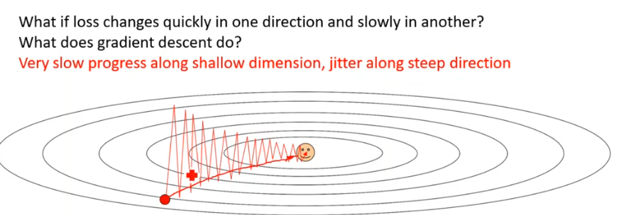
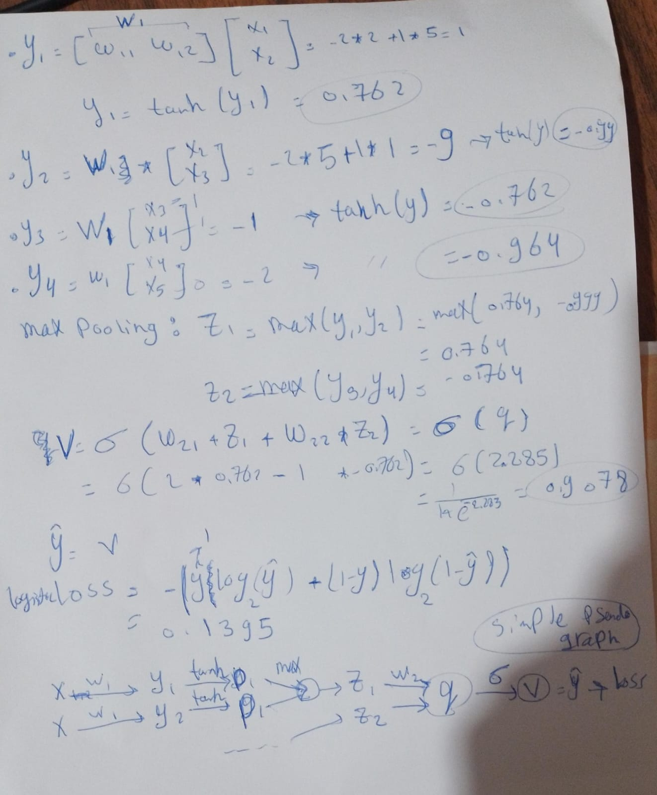
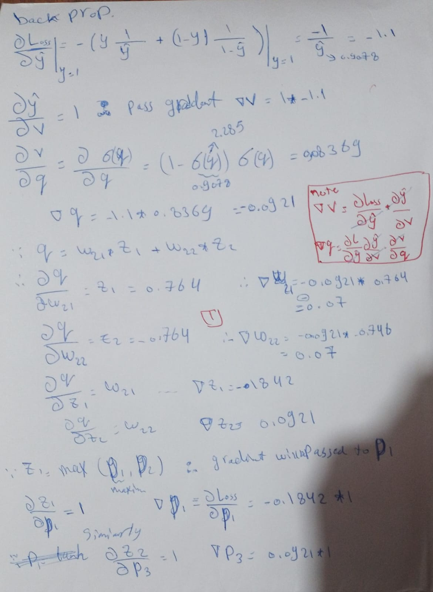
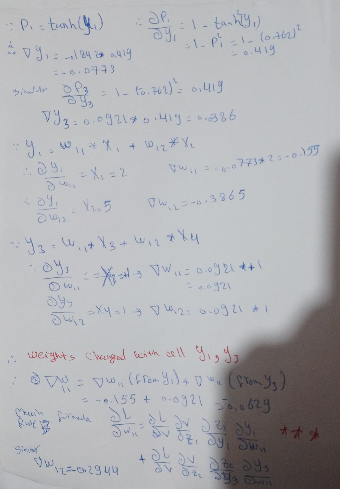
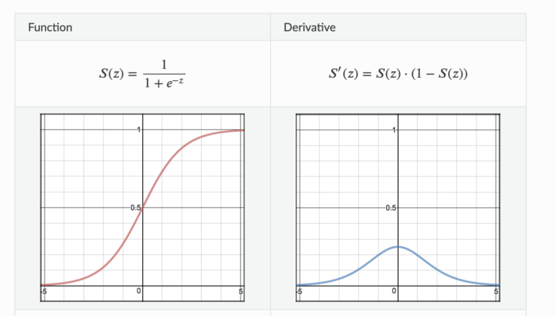
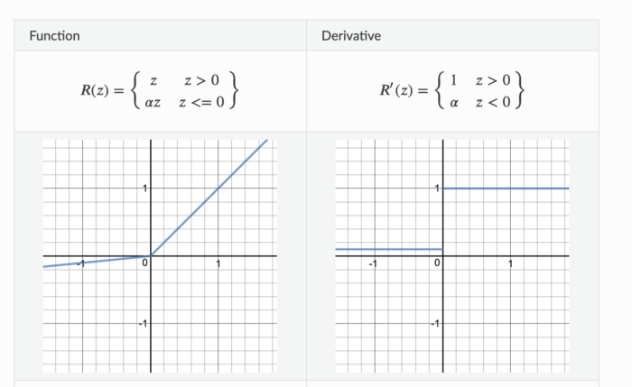
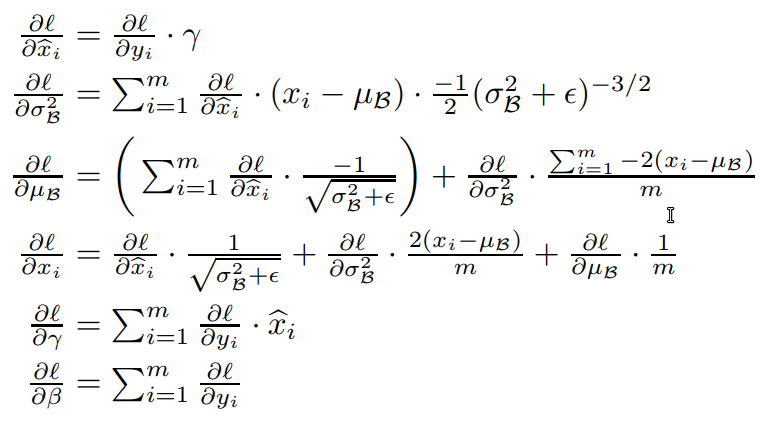

### Q1
Q1
saddle point is neither a local maximum nor a local minimum (local in a direction and not a local in another) in the loss function graph
SGD it overcomes the saddle point but slowly and oscillating  compared to other optimizers like Adam 
in batch SGD oscillations happens as it uses a batch. and it can diverge

Q2
1) loss
2) no. epochs
3) minimum validation/testing  loss
4) corresponding epoch no. (model checkpoint weights)
5) validation/testing loss curve against no. epochs 
6) training loss curve against no. epochs 

Q3
make the network not rely solely on specific neurons(features) and distribute its weight on them acting like taking the average like L2

Q4 
the residual block x + $f_{n}(x)$
in which if the gradient vanishes in block m it passes the gradient n-m blocks backward and the rest of the network continues to learn

### Q2

### Q3
Q1: 
- increasing size of the data
	- add more training data: if the model memorized the current dataset adding more will force it to generalize more, (but the new data must be different from the old "not duplicated" )
	- data augmentation: if we can't add more real data we will synthesize it adding different variations of the same data point ex: in images (noise, rotation, distorted contrast)
- adding noise 
- generated data samples from powerful generative bots like chatGPT, DALL-E
- feature selection: 
	There are many algorithms that you can use to perform feature selection and prevent from overfitting
	as the higher the complexity of the model, the higher chance to overfit
- Cross-validation: it simply shrinks the training data and use the remaining for testing and validation 
- Regularization: 
	- L1, Lp, L2 regularizations: penalty the model coefficients to go big
	- dropout: Probabilistically dropping out nodes from a NN layer making the model smaller "simpler" in the ==training== stage only, thus making the output more like an average 
	- When we drop different sets of neurons, it’s equivalent to training different neural networks. The different networks will overfit in different ways, so the net effect of dropout will be to reduce overfitting
	- as the higher the complexity of the model, the higher chance to overfit
- ensemble: 
	- late fusion the prediction is aggregated from several base models
	- early fusion: the models inputs are fused in some way 
- early stopping: stop the model training when the validation error began to increase with every training iteration (epoch) , and save that fairly good fit model weights 

Q2: 
ReLUs are much simpler computationally. The forward and backward passes through ReLU are both just a simple "if" statement
Relu solve the vanishing gradient for large number area of saturation in sigmoid 
model converges quickly
ReLU only saturates when the input is less than 0

Q3: 
Sigmoid, tanh: gradient( change activation function output vs input) vanishes for big absolute numbers 

relu: vanishes in negative no. only 
When inputs approach zero, or are negative, the gradient of the function becomes zero, no training happens

leaky relu: 
less vanishing problem than relu

Q4: 

the last 2 equations

### Q4
Q1: 
Relu solve the vanishing gradient for large number area of saturation in sigmoid 
model converges quickly
ReLU only saturates when the input is less than 0
When inputs approach zero, or are negative, the gradient of the function becomes zero, no training happens
-> leaky ReLu

Q2:
* closer to 0, as the generator is really bad and the discriminator can tell apart that the generated image is fake 
* the blue function, is more subtle variation than the orange as
	* solve the vanishing gradient in the start of the training faced in the orange cost function
		* the advantage here is that the generator gets a strong gradient signal so that it can quickly improve
%% 	* intuition: the generator seeks to maximize the probability of images being real, instead of minimizing the probability of an image being fake %%
* close to 1, that's mean the generator can now generate data that's as good as real and the discriminator classifies it as real ($P_G = P_{data}$)