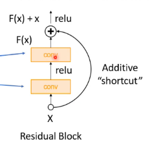
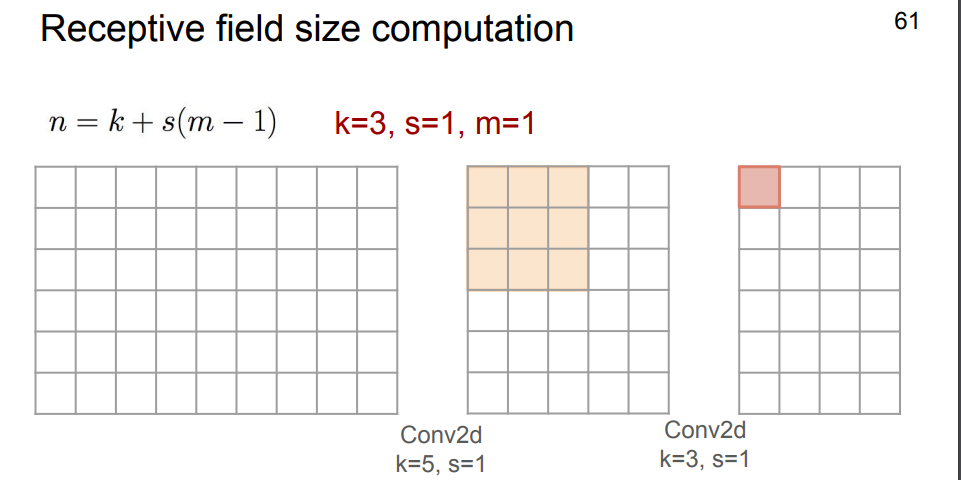
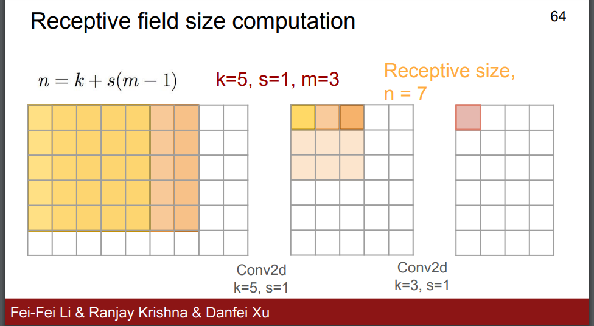

### Q1
Q1:

initializing all weights to zeros in forward propagation will lead to the identical output as All the neurons and each layer perform the identical operation.
and in backward it does not break the symmetry. All hidden units will have identical influence on the cost, which will lead to identical gradients. Thus, both neurons will evolve symmetrically throughout training, effectively preventing different neurons from learning different things.
This makes your model almost like a linear model, and the deep net useless

Q2:
smaller or equal

Q3:
as from the superposition property of linear operations that L1(L2(L3)) = L4 can be reduced to one linear operation, so the hugely deep neural network will equal to a shallow network  
making it can't capture strong complex features representations from the input data

Q4:
it initializes the weights such that the variance of the activations are the same across every layer

It aims to provide a suitable initial weight distribution that helps in ==efficient and stable training==. Here's why Xavier initialization is important:
* Addressing Vanishing/Exploding Gradients: Xavier initialization helps mitigate the vanishing and exploding gradient problems, it ensures that the gradients neither vanish nor explode as they propagate through the network. This allows for better gradient flow and more stable updates to the network parameters.
	   thus faster and efficient convergence (learning) and better performance
* Applicability to Different Activation Functions: Xavier initialization takes into account the type of activation function used in the network. It provides different scaling factors for activation functions with different characteristics, such as sigmoid, tanh, and linear activations.

Q6:
the residual block (**skip connections**)  x + $f_{n}(x)$
the "+" is modeling the identity i.e. solve the vanishing gradient
allowing the gradient to pass through to X in backpropagation unaffected by the bypassed two convolutions blocks 

Q7:

R_f dimension  $=((k-1) S) L +1 = ((3-1)1)4 +1 = 9$ 
$\therefore R_f size = 9X9 =81 Pixle$

alternative solution
1x1 <-3x3 <- 5x5 <- 7x7 <- 9x9
4th layer neuron <- 3th <- ... <- input image  

alternative solution Sandford 
n4 = 3 + 1(1-1) = 3
n3 = 3 + 1(3-1) = 5
n2 = 3 + 1(5-1) = 7
n1 = 3 + 1(7-1) = 9
$\therefore R_f size = 9X9 =81 Pixle$
- Sandford 
	- m = 1 single neuron unit	
	n1 = 3+1(1-1) = 3 
	n2 = 5 +1(3-1)= 7, m=old
	-> receptive field from input pixels = 7x7  
	how much the second (after the input layer) have seen from the input layer

Q8:

* Q1: closer to 0, as the generator is really bad and the discriminator can tell apart that the generated image is fake 
* Q2: 
	* the blue function, is more subtle variation than the orange as
	* solve the vanishing gradient in the start of the training faced in the orange cost function
		* the advantage here is that the generator gets a strong gradient signal so that it can quickly improve
 	intuition: the generator seeks to maximize the probability of images being real, instead of minimizing the probability of an image being fake 
* Q3: the discriminator should output values close to 0.5 for both real and generated data. If D(G(z)) is close to 1, it means the discriminator is confidently classifying the generated samples as real, which indicates that the generator has not yet learned to generate realistic data. Conversely, if D(G(z)) is close to 0, it means the discriminator is confidently classifying the generated samples as fake, indicating that the generator is producing poor-quality data.

### Q2

Q1:
1) 8(5x5x6) + 8x1
2) 8x10x10(20x20x6) + 8x10x10x1

==Q2:== 
layer 1 d_height = (256-3 +2p)/1 +1 = 256 
	| note: same width and height as the original image $\therefore p=1$
layer 2: d_height = (256-3)/2 +1 = 128

The receptive field is defined by the filter size of a layer within a convolution neural network." In other words, receptive fields are about the area (in pixels) covered by the convolutional filter(s), not the size of the input. **Padding changes the effective input size, so it can't change the receptive field**
so the padding will not affect it

R field = 1 + (pooling layer) + (conv layer) = 1 + (3-1)x2 + (3-1)x1 = 7
size of the receptive field = 7x7 = 49

n2 = 3 + 2(1-1) = 3
n1 = 3 + 1(3-1) = 5
$\therefore R_f size = 5x5 =25 Pixle$

### Q3
