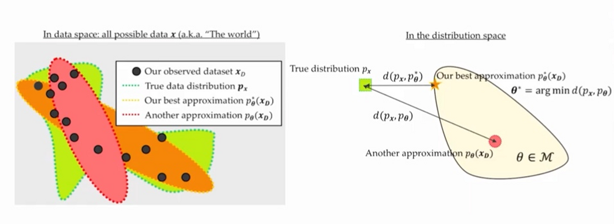
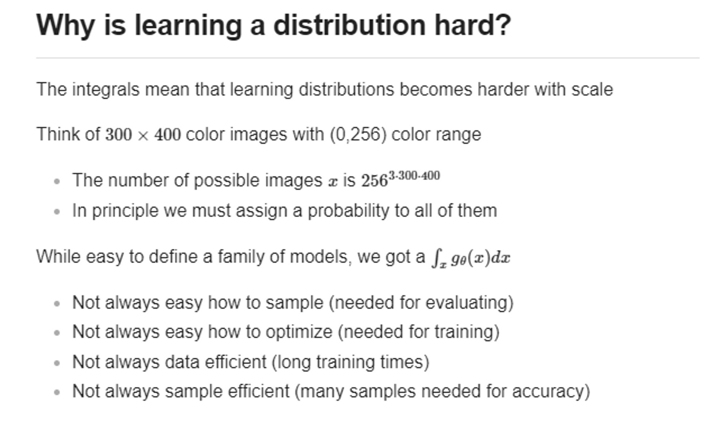
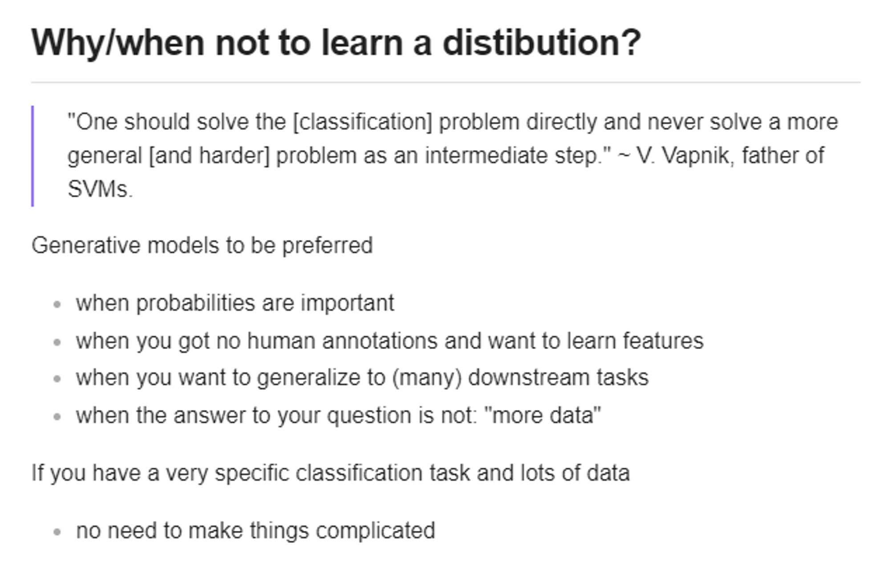
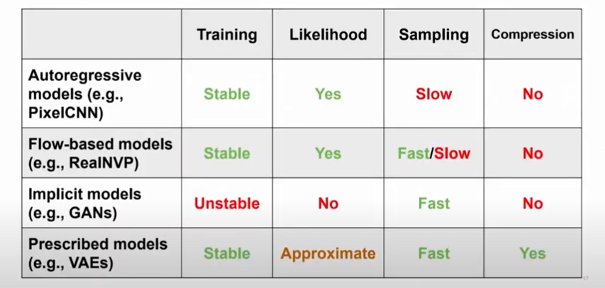
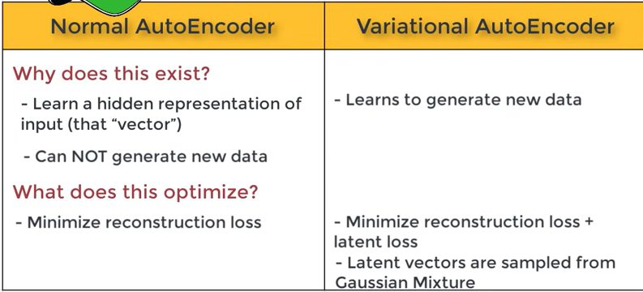
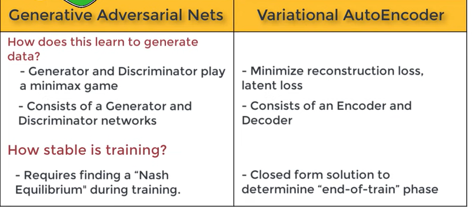
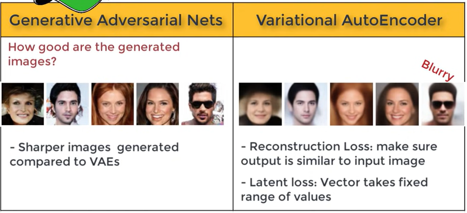
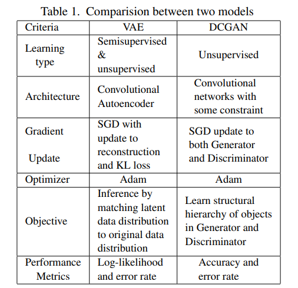

Generative: team of counterfeiters, trying to fool police with fake currency
Discriminative: police, trying to detect the counterfeit currency

why blurry and how to fix?
The reason is Decoder output a average value of all generated images or mean value of distribution.L1 loss can be used to reduce blurriness in generated images.

If in minimax game, Generator become more successful compared to discriminator for minimizing cost function than Discriminator learns nothing due to less gradient update. As a result Generator will be successful to fool the discriminator. An another name of this problem is mode collapsing, in which there is imbalance between modes in generated images. For example for this experiment, if mode collapsing occur than generator will generate some specific digit more compared to other digits. It is still an open research problem to solve.

A GAN is successfully trained when both of these goals are achieved:

1. The generator can reliably generate data that fools the discriminator.
2. The generator generates data samples that are as diverse as the distribution of the real-world data.

**Mode collapse** happens when the generator fails to achieve Goal #2–and all of the generated samples are very similar or even identical.

The generator may “win” by creating one realistic data sample that always fools the discriminator–achieving Goal #1 by sacrificing Goal #2.

**Partial mode collapse** happens when the generator produces realistic and diverse samples, but obviously much less diverse than the real-world data distribution. For example, when training a GAN to generate human faces, the generator might succeed in producing a diverse set of male faces but fail to generate any female faces.

that is the 5th caveat of training GANs mentioned by the doctor 

Solutions to mode collapse

-> Wasserstein loss Formulates the GAN loss functions to more directly represent minimizing the distance between two

https://machinelearning.wtf/terms/mode-collapse/