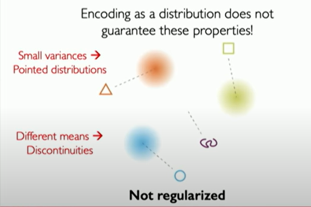

in regularized 
Normal prior -> continuity (in the space) + completeness (no empty areas in between)
as everything is regularized to have mean of 0 and std of 1

close point have similar construction (see the left shapes)

