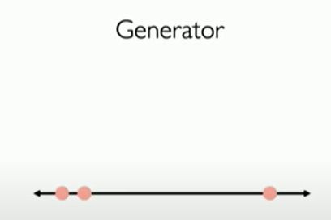
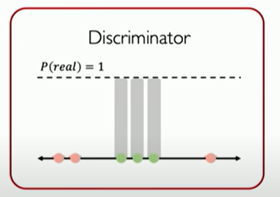
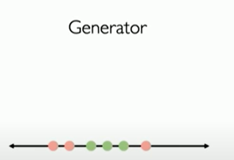
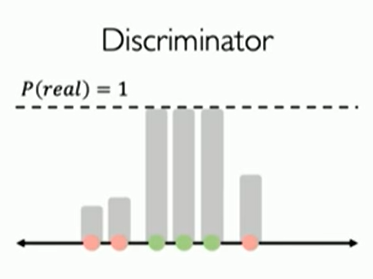
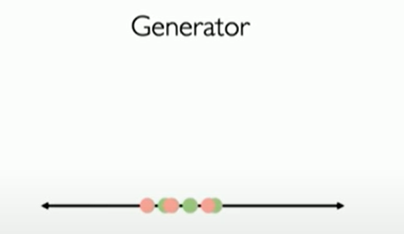

generator generate fake data

Discriminator try to separate the fake from real and output a probability for each data point where real = 1.0 and fake = 0

generator tries again to move its fake generated images closer to the real data making it more realistic

and the discriminator continues 

and the generator continues also till it becomes almost hard to tell what's real
