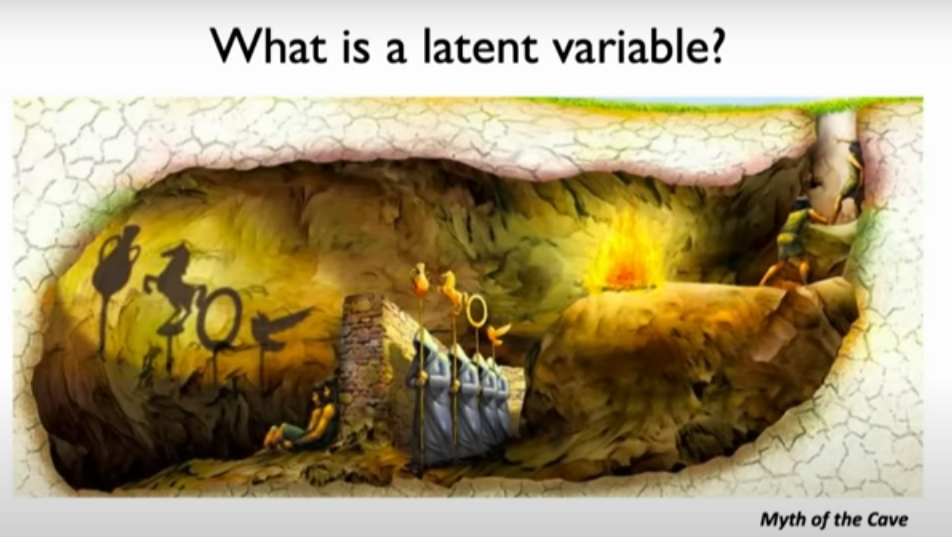
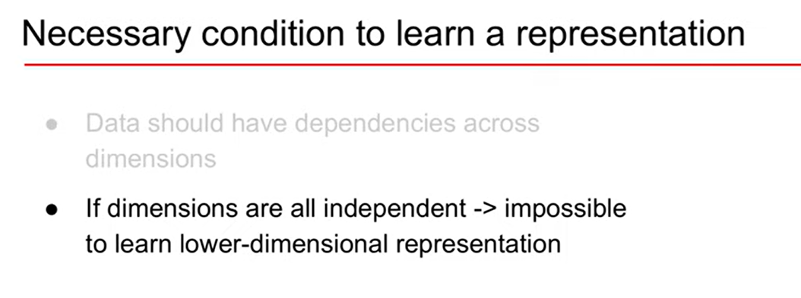
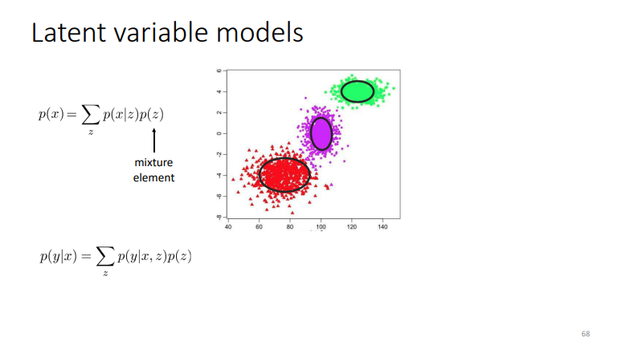
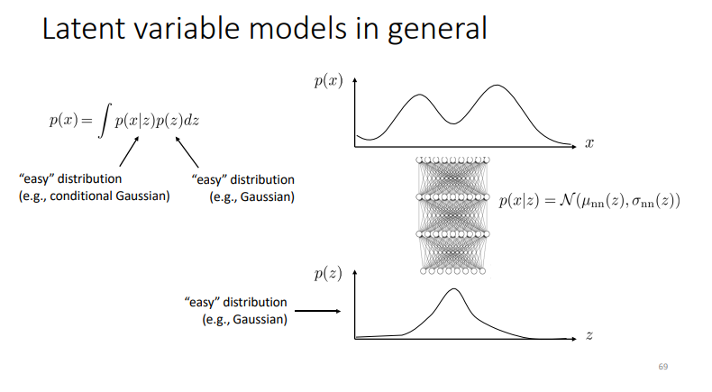

a latent variable is the ==hidden== representation (source) of the observed input

like the scary shadows on left and the source on right 

the Q is Can we learn the true explanatory factors. e.g. latent variables. from only observed data?

p(x) is scatter in the feature space
it doesn't take the regular known distributions like gaussian, binomial etc.

early in machine learning they used mixture of gaussian: 
	construct those distributions into combination of gaussian distributions like **Fourier** 

p(z) is normally gaussian, not necessarily have a covariance -> covariance is unity
z is a gaussian with some variance $\sigma{}$   thus giving by the ellipse form 
we can assume it with unit variance i.e. circle

estimate or approximate the p(x) not compute it.

p(x|z) if giving a point from the data z give me it's easy gaussian distribution like the red dots data
