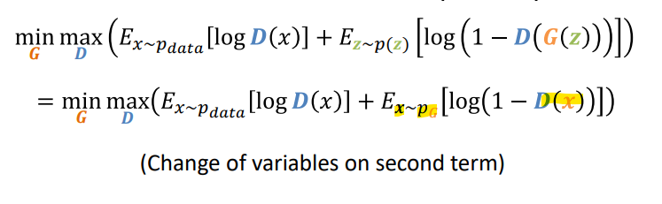

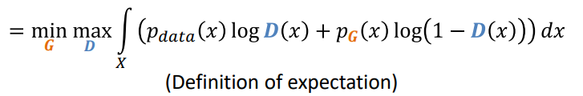 
	recall from [[Distribution comparison formulas]]

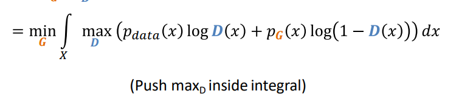

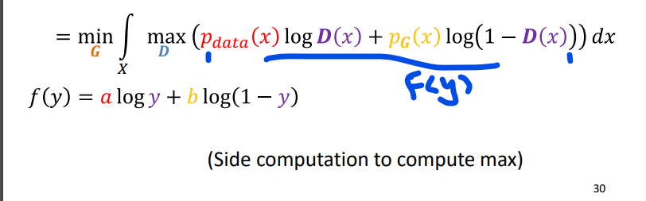
want to maximize he f(y)
analytically
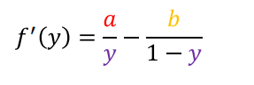
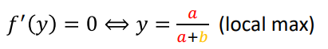
thus
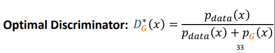
	check the optimal case if Pg = P_data then D output = 1/(1+1) = 50 % 👍

remove Max and substitute with D* (the max)
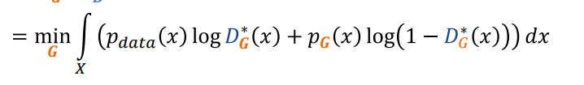
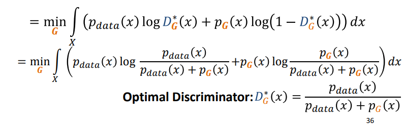

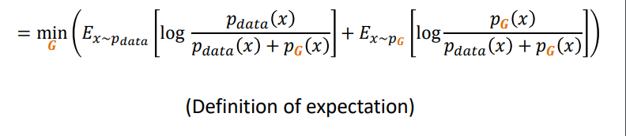
we want to make it into the divergence form
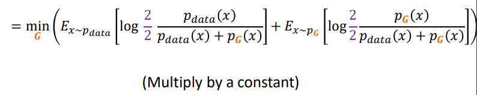
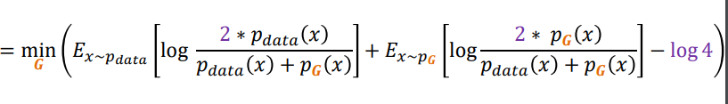

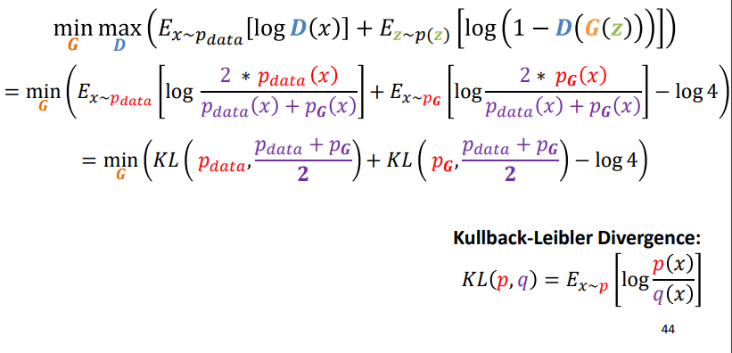
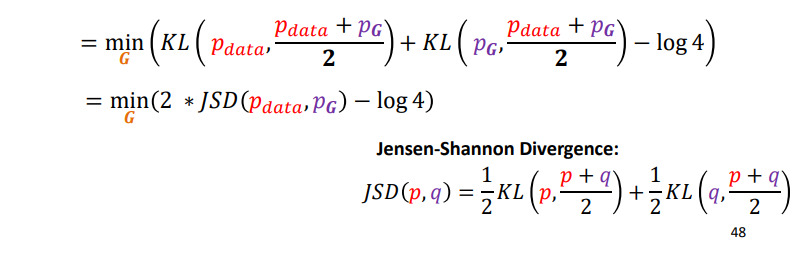
JSD is always nonnegative, and zero only when the two distributions are equal! Thus P_data = Pg is the global min
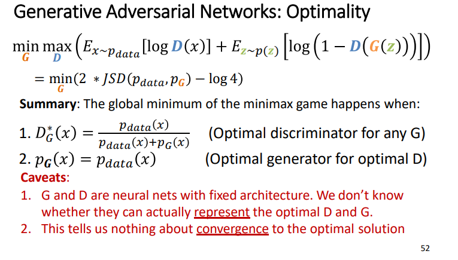
