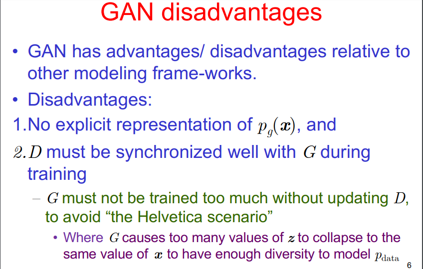

### Advantages of Generative Adversarial Networks (GAN’s)

- GANs generate data that looks similar to original data.  If you give GAN an image then it will generate a new version of the image which looks similar to the original image. Similarly, it can generate different versions of the text, video, audio.
- GANs go into details of data and can easily interpret into different versions so it is helpful in doing machine learning work.
- By using GANs and machine learning we can easily recognize trees, street, bicyclist, person, and parked cars and also can calculate the distance between different objects.

### Disadvantages of Generative Adversarial Networks (GAN’s)

- **Harder to train:**  You need to provide different types of data continuously to check if it works accurately or not.
- Generating results from text or speech is very complex

### Uses of Generative Adversarial Networks (GAN’s)

- GANs are helpful in marketing, advertisements, e-commerce, games, hospitals, etc.
- We can generate images for novels and other story writing stuff.
- GANs are mostly used in generating images and videos

https://cedar.buffalo.edu/~srihari/CSE676/22.3-GAN%20Mode%20Collapse.pdf
