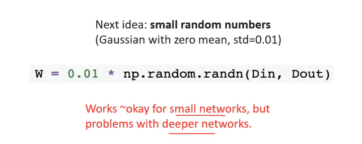
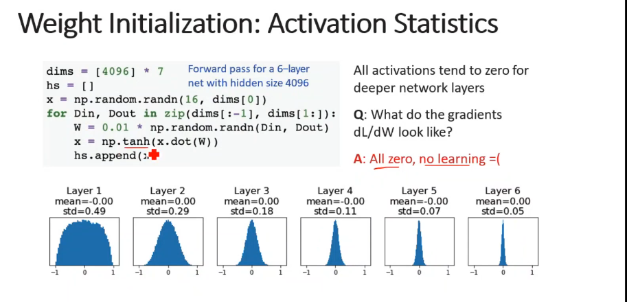
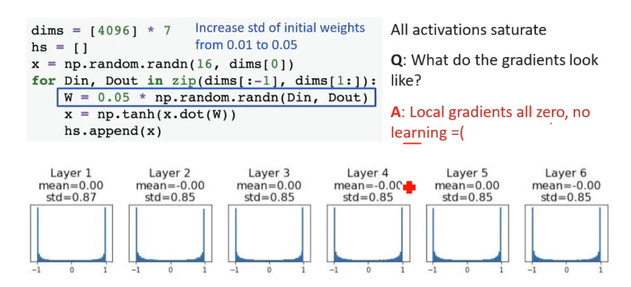
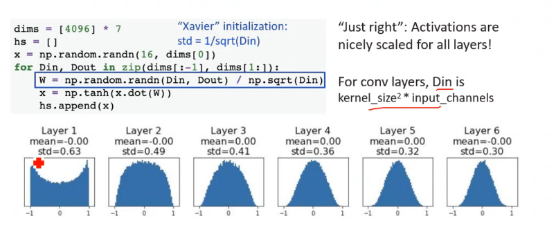
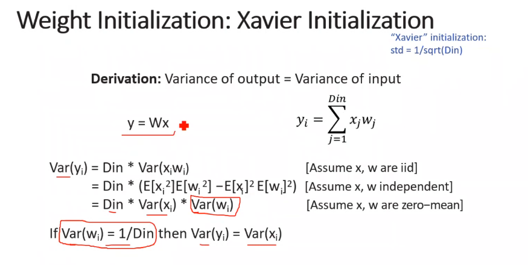
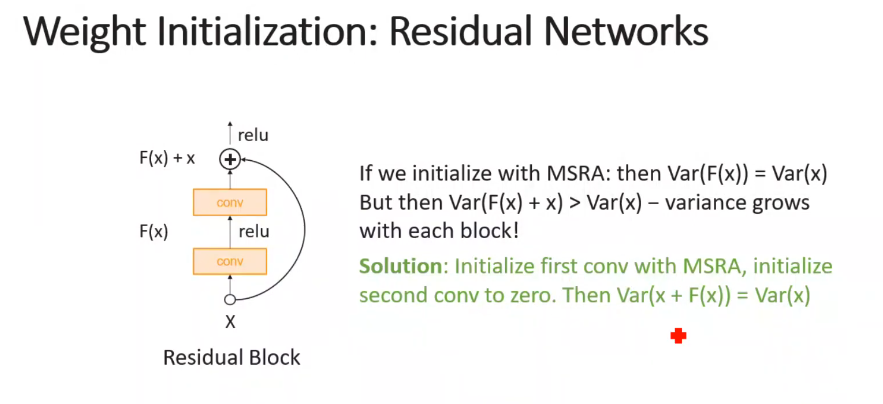

Q: What happens if we initialize all W=O, b=O?
A: All outputs are O, all gradients are the same! No "symmetry breaking"
i.e. no training will happen

	for vanishing and exploding gradients

### xavier init

Xavier assumes zero centered activation function
-> ReLU correction: std = sqrt(2 / Din) (takes half of the range (+))

